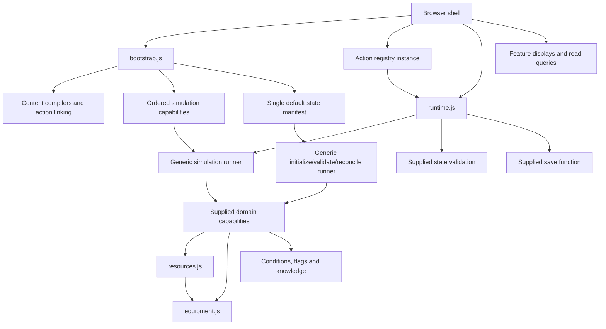

# Architecture and extension guide

The game uses plain modules, one serializable state tree, explicit composition,
and synchronous saved actions. Version-eight saves add persistent entity identity,
lifecycle, and authority to shared volumetric cargo storage. Versions one through
seven migrate explicitly without losing stock or history. See
[ENTITY_AUTHORING.md](ENTITY_AUTHORING.md) for the runtime contracts.

Version nine adds committed industrial Processing runs and finite location-scoped
resource nodes. V8 → v9 preserves the entity registry and counters and initializes
empty Processing; it never reruns identity migration. The Processing lifecycle
descriptor validates saved contracts and reconciles additive nodes without refill.
`processingCatalog.js` compiles resource/component batches and start-only conditions;
`processing.js` owns commitment, claims, slots, staged outputs and authority.
`processingSimulation.js` integrates power/work at physical boundaries through
the existing power/journey capabilities, preserving upfront navigation payments,
one candidate and one outer save. No fixed quantum, scheduler or offline runtime
is added. `processingView.js`/`processingDisplay.js` project only the occupied host.
See [PROCESSING_AUTHORING.md](PROCESSING_AUTHORING.md) for phase/blocker semantics,
ledger edges, machine construction and authoring extension points.

The additive Modular Vessel/Shipyard slice remains on save version nine.
`vesselModuleCatalog.js` compiles physical Product modules into assembly-owned
equipment groups. `vessels.js` derives current geometry, dry mass, cargo, tank,
power and speed from saved placement IDs and validates/reconciles them before
ordinary entity-local validation. `shipyard.js` commits one checked stock exchange,
new ship entity and `VESSEL_ASSEMBLED` record in the existing candidate transaction.
`vesselFuel.js` and `vesselCommandActions.js` extend existing movement, Processing
and transfer mechanics through exact physical endpoints and explicit authority.
See [VESSEL_AUTHORING.md](VESSEL_AUTHORING.md).

## Dependency direction



The registry-to-runtime connection is an explicit callback. Runtime results are
returned to the browser shell, which updates displays and publishes messages.
There is no gameplay event bus, dependency container, or automatic system loader.

## Ownership

| Owner | State or responsibility |
| --- | --- |
| `runtime.js` | Current state reference, candidate commits, simulation save interval, pause after failed frame |
| `simulationRegistry.js` | Immutable ordered step snapshots, synchronous advancement and generic reports |
| `stateComposition.js` / `stateLifecycleRegistry.js` | One default current-state domain manifest and generic ordered fresh-slice initialization, validation, and reconciliation |
| `worldLedger.js` / `worldLedgerTypes.js` | Bounded structured history, strict append and catalog-independent historical validation, detached read queries |
| `worldOperations.js` | Semantic gameplay creation, lifecycle, relocation and direct transfer; one recording owner per operation |
| `worldLedgerSimulation.js` | Shared adapter that requests persistence whenever a composed step appends history |
| `entityState.js` | Runtime entity/state consistency: authored identity, live/retained slices, and current-content instance repair |
| `entities.js` / `entityQueries.js` | Persistent IDs/lifecycle records and transient definition, label, state, and placement queries |
| `entityCreation.js` / `entityLifecycle.js` | Explicit domain construction and validated lifecycle transitions on a candidate |
| `authority.js` | Canonical title owner/controller and named permissions; domains retain feasibility checks |
| `entityReferences.js` / `entityComposition.js` | Typed reference validation and explicit composition of domain-owned collectors |
| `resources.js` | Quantity arithmetic, complete cost/reward exchanges, cross-store arithmetic, capacity admission |
| `quantities.js` / `storage.js` | Exact quantity conversion and formatting; read-only cargo volume, summaries and admission |
| `cargoActions.js` | Current owned-store discard, requiring an explicit amount and confirmation |
| `equipment.js` | Installation, weighted health, repair, upgrades, operating output, capabilities and passive capacity |
| `crafting.js` | Ingredient selection, recipe visibility, preview and execution, root crafting selection |
| `locations.js` | Local context, inspections, access, transfer endpoints, world presentation |
| `ships.js` | Navigation, docking, journeys, ship position, navigation-driven player movement |
| `npcs.js` / `dialogue.js` | NPC placement/contact and dialogue sessions/history |
| `flags.js` / `knowledge.js` | Explicit scoped flag writes and idempotent discovery grants |
| `conditions.js` | Independent syntax/validation/evaluation; runtime queries supplied explicitly |
| `conditionContext.js` / `conditionReferences.js` | Runtime equipment queries and separate compiler reference traversal |
| `effects.js` | Immutable descriptors, payload compilation, generalized metadata, ordered dispatch |
| `research/` | Detached experiment resolution, research progress, read-only presentation inputs |
| `stateCore.js` / `stateV7.js` / `save.js` | Root/version checks, initial assembly and explicit migration routing; frozen historical compatibility; localStorage I/O |
| `storageMigration.js` | Frozen historical quantity/capacity metadata; convert original legacy records before defaults |
| Display modules | DOM, focus, scrolling, tabs, local drafts, transcript and graph history |

Domain operations mutate only the supplied candidate or its explicitly supplied
slice. Initializers and migrations may construct/repair those slices. Treat
runtime `getState()` and compiled catalogs as read-only outside these operations.
They are ordinary objects, not deep-frozen proxies.

## Shared effects

`effects.js` supports `setFlag`, `discover`, `relocate`, `grantItem`,
`deactivateEntity`, `spawnEntity`, `activateEntity`, and `activateLocation`. Each
immutable descriptor owns `compile`, `describe`, `execute`, optional final reference
validation, and its required service name. Metadata distinguishes reusable
definitions from entity references, discovery production, flag writes, and contact impact. Domains consume metadata
without interpreting effect type strings. Reference traversal belongs separately
to `conditionReferences.js`; the condition core has no imports at all.

`compileEffects(authored, refs, trigger, path)` normalizes/validates authored data
once, including bulk amounts. Partial catalogs check what they know;
`validateEffectReferences` completes cross-catalog linking in bootstrap using each
compiler's explicit `effectSources` manifest (`path`, `effects`, `trigger`). Unknown
types/fields, wrong target types, and unsupported contextual aliases fail at
compilation. Authored entity references retain identity and do not become live
occupancy/lifecycle blockers merely because an effect targets an entity.

`applyEffects(candidate, compiled, effectServices, trigger)` executes synchronously
in authored order on the supplied root candidate. It captures `kind`, `locationId`,
`npcId`, and optional `actorId` once. `current` and `speaker` resolve from that snapshot, while target
availability remains a live domain check. Missing services/context throw; promises
cannot commit. The dispatcher has no save, root-state clone, renderer, event queue, or result
binding mechanism. The caller's existing runtime transaction supplies rollback.

`createEffectServices` in `bootstrap.js` binds seven permitted capabilities:
flag mutation, discovery grant, NPC relocation, checked item grant, entity
deactivation, entity activation, and entity creation. Both activation descriptors
use the same semantic activation wrapper; location activation limits target types. Creation, lifecycle, and relocation services delegate to `worldOperations`,
which records each meaningful transition exactly once. The dispatcher only forwards
captured provenance and never appends facts. Closures capture their domain catalogs/collectors; the dispatcher
never receives the whole systems object or imports high-level domain engines.
Pass these services explicitly to `createItemActions`, `createDialogueActions`,
`registerItemActions`, `createResearchActions`, `createLocationActions`, as the
fourth argument to `executeExperiment`, or as the fifth argument to direct
`performDialogue` calls.
Standalone consumers can compose services explicitly with `createEffectServices`,
supplying bound `worldOperations`. Silent primitives remain available for seeding,
migration, reconciliation, and physical movements inside larger gameplay operations.

Item-operation `completion: { scope, flag }` is independent from rewards. Legacy
singular flag effects normalize without changing their completion identity.
Version-eight saves retain their flag maps; no new persistence field is needed.
Grants create destination cargo through `grantItemsChecked`, using exact quantities
and storage admission without a source debit or clamping. Dialogue caches closing
text/history and safely handles contact cleared by deactivation or relocation.

The equipment-aware `conditionReason` adapter lives in `conditionContext.js`.
Isolated callers may instead supply explicit `queries.isOperational`,
`queries.hasCapability`, and contextual completion callbacks to the core. Missing
dependencies are checked throughout the tree before boolean short-circuiting.

`entityCreationSpec.js` shares pure validation between creation descriptors and
trusted creation primitives. Authored cargo/inventory overrides compile once;
runtime overrides already use internal units. Spawn specs are cloned and deeply
frozen during compilation, then copied for execution. Definition metadata is
never collected as a saved-entity reference or lifecycle blocker. The existing
trusted batch-creation bindings remain internal; effect-result bindings are deferred.

Research discovery `effects[]` execute only when an experiment first learns that
discovery. Resolution stays pure. Execution captures the learned set before any
reward, commits all experimental discoveries on the candidate, then runs rewards
in stable discovery-ID order and authored array order. Generic `discover` never
invokes rewards, including rewards of discoveries granted by another reward.
Preview, loading, reconciliation, and rendering never execute effects. Research
contracts now include canonical compiled reward arrays; old absent arrays normalize
to empty only when the remaining mechanical contract is compatible. Reward changes
to used progress require explicit migration. No reward ledger or queue is needed.

Location `inspectionEffects[]` and scene `effects[]` run from their existing saved
inspection actions. Effects and the existing `consoleExamined` / `examined:<id>`
completion markers share a transaction, separately per instance. Inherited arrays
are replaced by authored arrays, not concatenated. Startup notices remain read-only.

Authored site/ship/NPC `initialLifecycle` defaults to active and may be inactive.
Initialization and reconciliation apply it only when seeding a missing identity;
existing saved lifecycle remains authoritative. Areas and the starting site must
be active, and placement references must point to active instances. Version 8
already stores identities, lifecycles, completion flags, and research contracts,
so these compatible changes require no save-version bump. Pre-identity migration
preserves existing active assets when authored defaults change.

Automatic entry/arrival/timed hooks, generated areas, runtime effect-result
bindings, and broader Event System behavior remain deferred.

## Local stores and read projections

`getLocationContext(candidate, content, world, id)` exposes:

- `store`: resources, infrastructure, utility capacities and base `capacityVolumeUnits` for resource operations.
- `local`: the actual location slice for its owning mechanics.
- `id`, `definition`, `owned`, `permissions`, `actorId`, `actionIds`: instance identity and actor-specific access metadata. `owned` means title ownership only.
- `actionState`: the existing read/legacy projection for conditions and previews.

Production writes use `store`, domain operations, or explicit root state.
Never replace properties on `actionState` expecting to replace root state. Never
save a context or retain it across a commit; the next candidate needs new contexts.
Capacity queries read installed counts live, including installations made earlier
within the same candidate.

Example inside a validated custom action:

```js
execute(candidate, context) {
  transfer(context.store, { scrap: 20000 }, { iron: 1 }, content);
  setScopedFlag(candidate, "location", context.id, "surveyCompleted");
  return "Survey complete.";
}
```

The example consumes 0.02 m³ of scrap (20,000 internal volume units) and produces one counted part. `transfer` comes from `resources.js`;
`setScopedFlag` comes from `flags.js`. Resource helpers do not grant ownership or
validate arbitrary action payloads. The action/domain boundary validates those
payloads, access and supported quantity units before requesting arithmetic.

## Adding content

Continue using the existing item, location, NPC, dialogue and research authoring
guides. Supported content generates its inventory entries, recipes, actions and
UI without renderer branches. Cross-content links such as a discovery prerequisite
or an acquisition location are expected content edits.

Opening notices now belong to a location's `startupMessages`. Each has `text`,
optional shared `conditions`, and optionally an `equipment` ID with `healthBelow`.
They are evaluated on every startup/reload in authored order. They do not consume
resources or add saved history.

## Adding an action family

1. Create a feature module returning action definitions.
2. Assemble production feature actions in `bootstrap.js` alongside the existing
   feature factories. Default-world consumers reuse that same composition. For
   test/content variants, `buildGameSystems({ createAdditionalActions })` accepts
   an extra factory receiving compiled content, world, people and research. It
   runs before action linking; do not inspect final local action assignments
   inside the factory.
3. Give related actions a `collection`, for example `survey`, and reference it
   in location/type `actionSets`. Individual IDs can also use ordinary `actions`.
4. Write handlers using explicit candidate state and local context. Use owner
   functions for resource, equipment, flag and discovery changes.

```js
const systems = buildGameSystems({
  createAdditionalActions: ({ content, world }) => createSurveyActions(content, world)
});
```

`compileLocationCatalog` compiles structure first. `linkLocationActions` expands
collections after all features exist and rejects unknown assignments, unknown
collections, duplicate IDs and local command collisions. Existing action order,
inherited collection order and `removeActions` semantics are preserved.

Each application creates `createActionRegistry()`, registers the complete batch,
and connects current-state/context/transaction callbacks. Displays receive the
instance's query functions explicitly. Commands always recheck live requirements
inside the candidate transaction, even after a successful preview.

Runtime-target operations register once and supply read-only `targets` projections.
The action registry derives labels, legacy command IDs, and bound payloads from
the current state; creating an entity never mutates the action registry. Explicit
`permissions` apply to local and global actions. The browser binds the actor to
the player; trusted domain APIs may accept other actor IDs.

Catalog compilers expose `initialSpawns` separately from definitions. Runtime
existence comes from `state.entities`, with existing domain slices keyed by those
IDs. Destroyed/retired records keep identity, historical labels and frozen domain
state. Active simulation enumerates eligible instances, not catalog entries.
Domain-owned reference collectors and compiler `entityReferences` summaries keep
lifecycle logic independent of unrelated schemas. Occupants and navigation
dependencies must be explicitly resolved before unsafe transitions; contact
closes and historical references remain valid.

## Adding a system with saved state or time

Keep the mechanic in its own module and export narrow synchronous capabilities.
Timed mechanics join the explicit ordered step array in `bootstrap.js`; saved
validation/reconciliation joins `createStateDomains` in `stateComposition.js`.
Neither addition requires teaching runtime or current-state orchestration the
new domain's name. There is exactly one default state manifest: production,
direct core callers, and compatibility callers all use that factory.

Simulation steps have `{ id, advance(candidate, elapsedSeconds, context) }`.
They return `undefined` or `{ saveRequested?, output? }`. Save requests combine
with OR; output keys must be unique and cannot replace `previous` or `state`.
Default journey/contact adapters provide `arrivals` and `closure` for the browser
shell. The runner never saves or commits. Power advancement retains the existing
simulation-time increment, so time advances exactly once before journeys/contact.
Catalogs are bound in adapter closures; the optional per-update context is narrow.

Bootstrap applies `withLedgerSaveRequest` to every final selected step, including
custom steps, after construction-time composition. A changed ledger counter forces
validation/save before commit even on a short frame. The adapter preserves outputs
and leaves invalid or asynchronous reports invalid. Runtime and the generic runner
have no ledger dependency. Standalone consumers bypassing bootstrap must apply this
adapter themselves when their steps append history.

State descriptors have `{ id, initialize?, validate?, reconcile? }`. Catalogs/collectors are
bound by composition; validation is read-only, reconciliation repairs the load
candidate. Default validation order is entities, authority, entity instances,
ships, dialogue, knowledge/flags, research, world ledger, references, then crafting selection.
The entity-instance validator retains the existing combined iteration over
location and NPC state. `entityState.js` owns only those runtime consistency
checks and current authored-instance repair, not general lifecycle orchestration.

Reconciliation order is entity instances, dialogue, research, world ledger. Its context is
`{ notices, reconcileCurrentInstances }`. The boolean is retained because it
expresses the existing load-mode distinction without splitting the manifest or
adding migration phases: v8/v9 loads run entity preflight/repair; v1–v7 first use
frozen historical migration and explicit identity migration, then skip repeated
instance repair. Current dialogue/research reconciliation and final validation
still follow both paths. `initialize` runs only on a freshly assembled state,
after existing identity seeding and before validation. Its scope is a participant's
empty fresh-state slice; the ledger is its first participant. It never runs on
loads, actions, or frames. Existing initial assembly, seeding, and explicit legacy
migrations remain unchanged; this hook is not a general initialization or migration framework.

`buildGameSystems({ composeSimulationSteps, composeStateDomains })` optionally
accepts construction-time composition hooks. Each receives its default array and
compiled catalog/collector dependencies, returns the complete ordered manifest,
and runs once while constructing a game. Arrays/descriptors are copied and frozen.
These are not dynamic registries; there is no registration API or discovery.

```js
const systems = buildGameSystems({
  composeSimulationSteps: defaults => [
    ...defaults,
    { id: "example", advance(candidate, elapsedSeconds) {
      // Delegate to this domain's operation on the supplied candidate.
    } }
  ],
  composeStateDomains: defaults => [
    ...defaults,
    { id: "example", validate(candidate) {
      // Reject invalid domain state without mutation.
    } }
  ]
});
```

Use `systems.stateServices.createInitialState(seed?)`,
`migrateState(saved, notices?, legacyStorage?)`, and `validateState(state)` for
production/custom composition. These bind both catalogs and lifecycle for startup,
load, and runtime validation. `createGameRuntime({ ...systems, initialState, save })`
receives the bound validator, simulation steps, and action reconciliation callback;
an isolated runtime must supply those capabilities explicitly.

Core/compatibility positional functions remain available with optional trailing
lifecycle arguments. `validateState` also accepts optional collectors before the
lifecycle argument. Omitting lifecycle constructs the same default manifest from
the supplied catalogs; it never builds a default world inside core. If replacing
reference collectors for an existing session, explicitly recompose its lifecycle
and validator; previously bound closures retain their original dependencies.

Errors name the step/domain and phase, preserve the underlying message and `cause`,
and expose `participantId`/`phase`. Save failures remain persistence errors. Hooks
must finish synchronously; returning a thenable is rejected. Registries, catalogs,
contexts, and reports are not saved; no save-version change accompanies this round.

Preserve runtime ordering unless a new feature explicitly changes it:

1. Power production.
2. Journey advancement/arrival.
3. Contact reconciliation.
4. Conditional validation/save, then state replacement.

Only active entities advance. An authorized journey may belong to an unoccupied
ship; arrival changes its location state without relocating the player. Entity
creation, authority changes, and lifecycle operations use saved action transactions.

Actions always clone, execute, reconcile, validate, save and then replace state.
Ordinary frames may commit without saving; five active seconds, an arrival, or a
contact closure require a save. A failed frame leaves its candidate uncommitted
and pauses advancement. A successful saved action resumes it. The browser owns
visibility and elapsed-time sampling; it grants no hidden/offline time.

Presentation handles command echo before execution and result messages after
successful commit. Do not save, publish, touch the DOM, or perform irreversible
external effects inside a domain action. Do not make action execution asynchronous.

## Research and presentation boundaries

Compilers report `discoveryReferences.required` and `.granted` from their own
schemas. Research consumes summaries rather than walking unrelated content trees.
Requirement references remain accepted for legacy/custom knowledge compatibility,
but only actual external grants seed the prerequisite audit. A future grant
source can supply an explicit external discovery ID when building research.
Strict missing-reference rejection is deliberately not introduced here.

`visibleRecipes`, `transferOptions` and `researchInputView` supply shared policies
to displays. Research presentation compares returned values rather than listing
every state field a condition might inspect. Previewing never draws randomness.
Journal labels, focus, transcript and selection handling stay in presentation.

## Volumetric storage and quantity boundaries

`resources.js` previews all inputs and outputs before writing quantities. It calls
`storage.js` to assess complete before/after cargo and `equipment.js` for passive
capacity. Costs must be affordable before rewards. Physical rewards never clip;
utility production uses the explicitly utility-only clamping operation.

Authors and players specify bulk in m³. Compile once to integer cubic centimetres
(1,000,000 per m³); counted items remain integers and power remains fractional.
Only content/UI boundaries parse authored/player amounts. Domains, action payloads,
and saves use internal units; `formatQuantity` is their presentation boundary.
`capacity()` is utility-only; cargo consumers use `storageSummary` or `maxReceivable`.

Overloaded saved sites remain valid. Admission permits a final load that fits, or
one that does not increase an existing overload's occupied volume. Fresh content
must fit. Areas cannot hold physical cargo. Confirmed discard consumes current
owned cargo through the normal saved action; it cannot target installed equipment,
power, remote stores, or NPC inventories. Ships retain their existing stores and
navigation rules, including while overloaded.

Migration converts original legacy records before current defaults or NPC
reconciliation. A successful version upgrade is validated and saved before app
startup; failures preserve the old save. See `STORAGE_SYSTEM_IMPLEMENTATION_PLAN.md`
for the design, balance values, and verification matrix.

## Save-version policy

`SAVE_VERSION` identifies the boundary requiring a non-additive structural or
interpretation migration. It is not an exact fingerprint of every required field
in the current runtime schema. An on-disk version can have compatible additive
encodings that load reconciliation normalizes to one canonical validated shape.
This is the project-wide policy, made explicit during the World Ledger design
review and used by its implemented fresh-state and load participants.

An additive field may retain the save version only when its absence unambiguously
means an empty or neutral default, no existing fields change meaning, and existing
assets, progress, history, and RNG are preserved. Reconciliation must be
deterministic and idempotent. It must not replay gameplay/rewards or replace a
malformed present field with a default. Canonical state validation runs after
normalization; direct validation need not accept every older on-disk encoding.

Removing or renaming authoritative fields, changing quantity units or identity
meaning, reinterpreting progress, or requiring a non-neutral/data-dependent
conversion requires explicit migration. Structural/interpretation changes use a
new save version. Content-balance changes may use existing explicit domain
contracts where appropriate; compatibility cannot be established simply by
calling a change additive. Preserve the original save if conversion, validation,
or persistence fails.

The empty `worldLedger` qualifies for same-version defaulting because
missing history means no recorded recent events and grants no gameplay benefits.
It therefore remains on v8. Structurally valid content
IDs stored only in this supplementary history may outlive their current catalog
definitions; that tolerance does not relax authoritative research, inventory, or
entity invariants. Persistent historical entity references remain strict because
terminal identities are retained. See
[the ledger implementation plan](WORLD_LEDGER_IMPLEMENTATION_PLAN.md).

## Structured world ledger

Current world state remains authoritative. `state.worldLedger` supplements it with
recent facts; terminal messages remain immediate presentation through the existing
bus. The ledger has no subscribers, gameplay execution, generated text, independent
saving, state diffing, or replay. No narrative or NPC knowledge model is implied.

The saved slice is `{ nextId: 1, entries: [] }`. Each entry has numeric `id`,
`type`, simulation `time`, nullable `actorId`, `targetId`, `locationId`, `areaId`,
normalized `importance`, and a typed `data` payload. IDs use a separate monotonic
counter; entity allocation is unaffected. Importance defaults are authored per
type and may be overridden by the semantic caller. Amounts use canonical internal
units plus a captured `quantityKind`, never formatted quantities or cargo snapshots.

`worldLedgerTypes.js` declares eleven supported types: ship departures/arrivals,
direct resource transfers, entity creation/activation/deactivation/destruction/
retirement, NPC relocation, research completion, and equipment repair. Only real
transitions and completed actions produce facts; power, travel progress, partial
research insight, generic discovery grants, and no-op relocation remain silent.

`systems.ledgerServices.append(candidate, input)` stamps the candidate's simulation
time, validates and detaches facts, appends, and returns the numeric ID. Append-time
catalog checks receive only named capabilities (`resourceKind`, current equipment,
method, or discovery ID predicates). Historical validation takes state alone:
content IDs may outlive catalog entries and quantities retain their recorded kind.
History validates encoded facts and retained identities, never current cargo,
equipment health, placement, ownership, or whether a past transition still holds.
All entity references use retention roles and cannot block lifecycle changes.

Use `systems.worldOperations` inside an existing action/frame candidate for semantic
creation, lifecycle transitions, relocation, or a direct `transferResources` operation.
Low-level `moveExact` and the checked compatibility facade `transferBetweenLocations`
remain silent. A future trade, production batch, reward, or logistics operation
performs its physical movements silently and emits its own higher-level fact at
the layer that understands the action. No automatic transfer records are inherited.

Read helpers exported by `worldLedger.js` return detached newest-first entries:

```js
recentLedgerEntries(state, { areaId: "vicinity", since: state.simulationTime - 3600 });
ledgerEntriesForEntity(state, "ship_42", { minImportance: 0.4 });
ledgerEntriesAtLocation(state, "habitat", { type: "RESEARCH_COMPLETED", limit: 10 });
```

Filters are limited to type, actor, target, location, area, inclusive time range,
exclusive `afterId`, minimum importance, and result limit. Entity queries match
all declared involvement, including payload references. Place queries match the
recorded location, not present placement. These functions also support development
inspection; there is no new mandatory UI.

FIFO retains at most `WORLD_LEDGER_LIMIT` entries (provisionally 200), with a 2,048
JSON-character entry bound. Validation requires increasing unique IDs below
`nextId`, not a contiguous suffix, so future selective pruning can preserve the
schema. Importance does not affect retention today. Measure Processing event rates
before settling the limit; permanent consequences belong in normal state.

The composed `world-ledger` participant initializes fresh history, defaults only
an absent field on load, and validates before reference collection. Present malformed
history fails startup without replacing the save. Loading and reconciliation never
invent facts. Writer errors, later operation failures, validation errors, and save
errors discard the whole candidate, including trimmed entries and ID increments.
Processing records its committed-run transitions and depletion through these
services. Its synchronous ledger batch retains per-entry validation while avoiding
repeated validation of the entire retained window during clustered completions.
Trading, Actor Goals, and Event Director integrations remain future work.

## Retained compatibility

- `stateCore.js` accepts explicit catalogs without evaluating default worlds.
  `state.js` retains default arguments and re-exports world helpers;
  `worldCatalog.js` obtains its defaults from the same bootstrap as production.
- `buildLocationCatalog` still accepts an already prepared action list.
- `crafting.js` re-exports resource exchange helpers for older callers.
- `playerActions.js` retains a legacy standalone registry; the running app uses
  its own instance. Browser integrations should use the app's exported
  `executeAction`, which invokes the actual production transaction.
- `actionState` remains available for old callers and read-only previews.
- The terminal message bus, solar instrument projection and explicit historical
  save mappings remain. They do not need additional frameworks.

## Narrative and Operations presentation

`bootstrap.js` explicitly composes read-only providers into `systems.narrative`.
Domain queries produce detached typed facts; the context builder consumes existing
authority/visibility, coarse world observability and observer knowledge. NPC speech
interests only narrow candidates. Beat selection and authored deterministic text
realization receive no raw gameplay reads or mutation capabilities. Mixed beat
provenance derives from fact bases and consumes the history quota. The fixed v1
seed is cosmetic configuration, not a saved per-world seed or research RNG.

`processingQuery.js` contains the one pure instantaneous readiness/allocation
planner consumed by simulation and read projections, including ordered delivery
previews that release machine capacity before work allocation. Narrative never
uses stale saved blockers as readiness or recreates this calculation. Processing
may return transient working→delivery phase-edge reports in simulation output;
they are presentation trigger hints and do not alter ledger/save semantics.

`narrativePresentation.js` reads a successful runtime result's previous/current
snapshots and explicit semantic reports/new ledger records. Application policy
admits meaningful local transitions, consolidates one bounded internal
`operations_update` request, and uses weak transient commit identities for
automatic duplicate suppression. Domains and providers never request publication.
No generic diff engine, narrative bus, saved queue/cursor, memory simulation or
ledger consumption fields are introduced. Existing log entries remain observation
receipts; automatic publication preserves tab/focus, explicit Observe/Inspect
reveals Operations, and authored dialogue stays in People. Narrative failures are
isolated from commit/save failures. See [NARRATIVE_AUTHORING.md](NARRATIVE_AUTHORING.md)
for request contracts, metadata, tuning and extension boundaries.

## Verification

Run `node --test tests/*.test.mjs` and, with Playwright available,
`node --test tests/terminalTabs.browser.mjs`. The browser suite uses isolated saves.
`tests/refactor.test.mjs` exercises the production runtime, independent registries,
new action collections, shared resource boundaries and content reference summaries.
`tests/simulationRegistry.test.mjs` and `tests/stateLifecycle.test.mjs` prove
construction-only extension with fake participants, immutable ordering, failure
attribution, transaction preservation, version routing, and an acyclic production
import graph. Neither fake domain adds production content.
`tests/worldLedger.test.mjs` and `tests/worldLedgerIntegration.test.mjs` cover strict
append versus tolerant history, quantity kinds, bounds, detached queries, retained
references, exactly one production recording owner, silent repair/movement paths,
automatic frame persistence, and transaction rollback including FIFO eviction.
The browser suite also exercises history reload, removed historical content IDs,
malformed-save preservation, effect rewards, and failed reward rollback.
