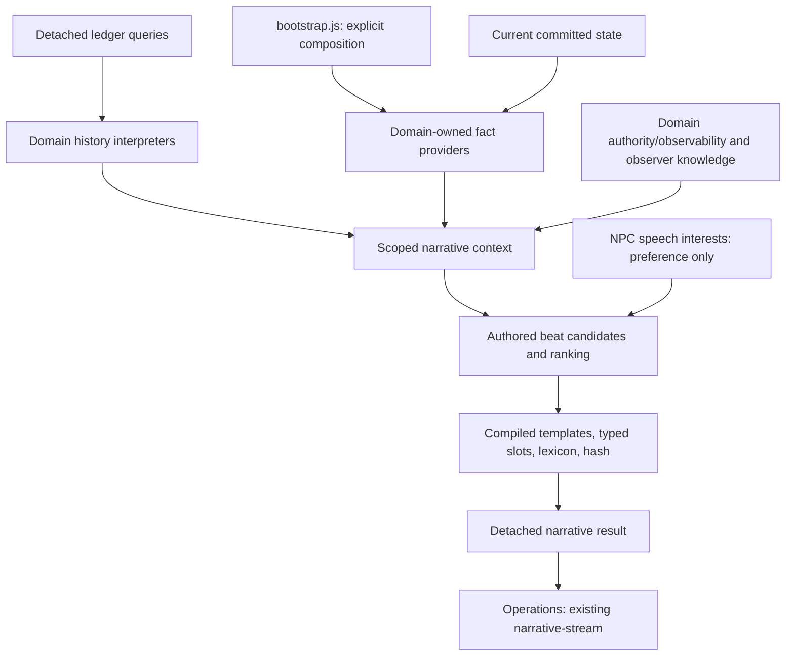

# Narrative Context / Procedural Text System — implementation plan

Status: v1 implemented on 2026-09-27. The design below retains the approved architecture and incremental scope; the concrete shipped contracts and authoring instructions are documented in [NARRATIVE_AUTHORING.md](NARRATIVE_AUTHORING.md). The expected module list remains a design inventory: small helpers were consolidated rather than scaffolding every proposed filename. No saved narrative slice or save-version change was added.

**Gameplay systems determine what is true. Narrative determines what is worth mentioning and how to describe it.**

The recommended v1 is a read-only, explicitly composed capability with detached typed facts, bounded context, transparent beat selection, and authored deterministic realization. It needs no simulation step, gameplay event bus, saved narrative slice, or save-version change.

All generated player-facing narrative is delivered to **Operations → the existing `#narrative-stream`**. Location, equipment and NPC surfaces describe request types and entry points, not separate destinations for generated prose. Existing maps, machine controls and authored People conversations retain their own interfaces.

Presentation supports three distinct triggers: **explicit observation**, **direct-action aftermath**, and **automatic world-transition narrative**. Gameplay determines what changed; application presentation decides whether to request prose now; the same read-only narrative pipeline describes the committed result truthfully. Section 22 defines this policy and its deliberately small initial scope.

## 1. Existing architecture and concrete conflicts

The game is vanilla browser JavaScript with ES modules and Node `.mjs` tests. There is no build step or application dependency container. `buildGameSystems` in `js/bootstrap.js` compiles catalogs, composes narrow services, constructs actions before location action linking, and supplies state and simulation manifests. New narrative composition belongs there; default and standalone callers already share this path through `js/worldCatalog.js`.

| Foundation | Actual implementation and implications |
| --- | --- |
| Entity identity/lifecycle | `entities.js`, `entityQueries.js`, `entityLifecycle.js`: persistent runtime IDs, reusable definition references, active/inactive/retired/destroyed lifecycle, and retained historical labels. Resolve instances through `locationDefinition`, `npcDefinition`, and `getEntityLabel`; never assume runtime ID equals definition ID. |
| Locations/local assets | `locations.js`: `getLocationContext` returns live `local` and `store` objects plus a read/legacy `actionState` projection. None may escape into narrative context or be retained across commits. Sites, ships, and areas share location definitions. |
| Equipment | `equipment.js`: infrastructure is a group at a host, `{ quantity, health, enabled, upgrades }`, with aggregate health. There are no individual solar-array or refinery entity IDs. `isOperational` means installed, enabled, positive health; it does not prove that equipment currently receives power. |
| Resources/storage | `resources.js`, `storage.js`, `quantities.js`: power is a separate utility; bulk resources use integer volume units, components/products use counts. Use existing queries and formatters, preserving overload and exact quantities. |
| Power | `game.js` exposes `powerRate`, `createView`, and `advanceGame`. `powerRate` is net equipment production/consumption, excluding active Processing demand. No grid instability, pressure, radiation, or brownout state exists. |
| Processing | Already implemented in `processing.js`, `processingSimulation.js`, `processingCatalog.js`, `processingView.js`. Saved runs have numeric IDs, host/group IDs, `working` or `delivery` phase, blocker overlay, committed input/output snapshots, work remaining, and extraction claims. The simulation supports fractional power allocation. |
| Ships | `ships.js`: current `areaId`, `dockedAtId`, and `journey` determine presence/movement. Boarding, undocking, journeys, and arrivals are distinct operations. No production starter ship currently exists. Test/content fixtures supply ships. |
| NPCs/dialogue | `npcs.js`, `peopleSystem.js`, `dialogue.js`: exact local presence, condition-based visibility, contact checks, authored greetings/topics/choices, saved session/revision tokens, flags and completion. NPC state currently contains placement, inventory, flags; no general activity, relationship score, job assignment, or goals. |
| Knowledge/research | `knowledge.js`, `research/`: known discoveries, authored research catalogs and hints, deterministic experiment resolution. `state.research.rng` is mutable gameplay RNG. Research already saves authored experimental observations; this proposal does not change that existing journal contract. |
| Ledger | `worldLedger.js`, `worldLedgerTypes.js`: newest 200 records, stable monotonically increasing integer IDs, simulation timestamps, typed payloads, detached filtered queries, catalog-tolerant historical content references. Includes Processing events now. |
| Effects/runtime | `effects.js`, `worldOperations.js`, `runtime.js`: mutations happen on a candidate, validation/save precede publication, failures roll back. Narrative must never dispatch effects or mutate candidates. |
| Registries | `simulationRegistry.js`, `stateLifecycleRegistry.js`, `stateComposition.js`: construction-time immutable manifests. Narrative is a read capability, so it joins neither manifest. |
| Presentation | `app.js` publishes opening descriptions and committed receipts; `locationDisplay.js` shows remote map descriptions; `dialogueDisplay.js` owns transient transcript/selection; `processingDisplay.js` shows machine cards. `eventBus.js` is a terminal presentation bus, not world history. |

Concrete adjustments to the suggested design:

1. Model equipment subjects as `(hostId, equipmentId)` groups, and runs as `(hostId, equipmentId, runId)`. Do not create equipment identities for narration.
2. Replace the example `brownout` with supported observations: reserve level, net equipment flow, and domain-confirmed power-limited Processing. Zero reserve does not imply every machine or life-support system is stopped.
3. `NO_POWER` can mean **reduced progress**, not total stoppage. Never automatically realize it as "gone quiet" or "stalled."
4. `delivery` means work is finished and output remains buffered. `PROCESS_COMPLETED` is emitted **after successful cargo delivery**, immediately before removal of the run. Do not conflate those facts.
5. `SHIP_DEPARTED.locationId` is the origin **area**, not the undocked site. Undocking itself currently emits no departure record. A site query cannot reliably say "a freighter left this station" from this event alone.
6. Existing `inspectSite` and `inspectScene` are one-time gameplay actions with flags/effects. Repeatable narrative observation must not repeat their rewards or completion.
7. Existing raw location descriptions contain stateful phrases, including "life support" hum and "empty storage racks." Audit the prose used as persistent identity so a static base cannot contradict new current-state narration.
8. No immutable world seed is stored. Do not use `research.rng` or derive a fake original seed from it.
9. NPC knowledge cannot infer past witnessing from present placement: the ledger stores no attendance history or witnesses.

No fundamental conflict requires redesigning any foundation. The only proposed domain logic extraction is a small shared read-only Processing observation query, described below.

Key source anchors: [system composition](C:/Users/Bud/Documents/SpaceGameText/js/bootstrap.js:51), [aggregate equipment semantics](C:/Users/Bud/Documents/SpaceGameText/js/equipment.js:8), [finished-work transition](C:/Users/Bud/Documents/SpaceGameText/js/processing.js:120), [delivery completion](C:/Users/Bud/Documents/SpaceGameText/js/processing.js:132), [navigation recording](C:/Users/Bud/Documents/SpaceGameText/js/ships.js:72), [ledger descriptors](C:/Users/Bud/Documents/SpaceGameText/js/worldLedgerTypes.js:75), [dialogue start](C:/Users/Bud/Documents/SpaceGameText/js/dialogue.js:166), and [mutable research RNG initialization](C:/Users/Bud/Documents/SpaceGameText/js/research/researchState.js:10).

## 2. Responsibility and dependency boundaries



Rules:

- Providers may read their own domain APIs and bound catalogs. They may depend on generic entity queries, authority, and shared quantity utilities. They do not import other domain providers or displays.
- Exactly one pure domain-owned Processing readiness/allocation calculation serves both simulation and read queries. The narrative adapter consumes its result; the selector and realizer never import `processing.js` or `processingSimulation.js`.
- The context builder receives bound subject-resolution and knowledge capabilities, not a whole application services object.
- The selector receives only detached context/facts, surface policies, and authored beat rules. It cannot query raw state or catalogs.
- The realizer receives selected beats, typed display values, semantic dimensions, and a variation seed. It cannot query state, ledger, effects, gameplay RNG, or DOM.
- UI entry points receive a narrow observation callback. `app.js` requests `narrative.describe(state, request)` and publishes the resulting plain text through the existing terminal presentation bus into Operations' narrative stream. Entry points do not collect facts or decide world truth.
- Gameplay mutation functions and Narrative Fact providers never call `narrative.describe` or publish stream entries. Domain transition reports describe semantic changes only; automatic request/publication policy belongs to the application/presentation layer, after commit (section 22).
- No getters, lazy callbacks capturing state, or live gameplay references may be embedded in facts or downstream contexts.

## 3. Narrative Fact contract

Use small discriminated objects with a minimal common envelope and **kind-specific payloads**. Document them with JSDoc typedefs/unions in plain JavaScript. A narrow validator checks provider output in tests/development; production providers construct known shapes. No TypeScript conversion, large generic JSON schema, or mutable fact registry is needed.

Common fields:

```js
{
  key,                 // stable canonical tuple string, not a saved ID
  kind,                // discriminator selecting a documented payload
  basis,               // 'current' | 'history'
  subject,             // typed subject reference; examples below
  locationId,          // exact host/context if applicable, otherwise null
  areaId,              // physical area if known, otherwise null
  importance,          // finite 0..1, domain/authored priority
  severity,            // finite 0..1; 0 for non-problem facts
  exposure,            // detail classification only; never an authorization grant
  evidence,            // structured provenance; never prose
  data                 // payload specific to kind
}
```

Subject references:

```js
{ type: 'entity', id: 'habitat' }
{ type: 'equipment_group', hostId: 'habitat', equipmentId: 'thermalProcessors' }
{ type: 'process_run', hostId: 'habitat', equipmentId: 'thermalProcessors', runId: 12 }
{ type: 'resource_node', locationId: 'habitat', nodeId: 'surfaceMinerals' }
```

Representative payloads, using actual production IDs:

| Kind | Payload and source |
| --- | --- |
| `location_identity` | `{ name, baseText, dimensions }` from instance-resolved definition and retained identity rules. |
| `equipment_condition` | Coarse `{ equipmentId, name, conditionBand }`; authorized diagnostic projection may additionally include `{ quantity, health, enabled, operational }` from installed group and `isOperational`. Coarse observability never carries the private exact values downstream. |
| `power_reserve` | `{ available, capacity, reserveBand, equipmentNetRate, flowBand }` from `quantity`, `capacity`, `powerRate`. `equipmentNetRate` is explicitly not total flow during Processing. |
| `process_activity` | `{ runId, processId, processName, equipmentName, phase, blocker, workState, pendingOutputs? }` from domain read observation. Output lines are exposed only with cargo access. |
| `equipment_activity` | `{ quantity, attachedRuns, workingCount, powerLimitedCount, unavailableCount, deliveryCount, freeSlots }` from the Processing read query; supports truthful group-level descriptions. |
| `storage_condition` | `{ usedVolumeUnits, capacityVolumeUnits, overloadVolumeUnits, fillBand }` from `storageSummary`; usually low priority unless overloaded or near full. |
| `resource_node_condition` | `{ nodeId, resourceId, resourceName, remaining, claimed, available, reserveBand }` from current node and `claimedReserve`. Fully claimed is not depleted. |
| `ship_presence` | `{ name, presence: 'docked' | 'in_area', dockedAtId }` from active ship current placement. No invented hull condition, cargo, commercial role, or arrival origin. |
| `ship_movement` | `{ name, targetId, targetName, journeyKind }` from current journey, not history. |
| `npc_presence` | `{ name, subtitle }` for currently visible local active NPCs. |
| `player_npc_context` | `{ met, authoredContextKeys }` from `dialogue.met` and explicitly mapped authored flags. No invented relationship level. |
| `recent_process_activity` | `{ eventType, runId, processId, equipmentId, outcome, occurredAt, ageBand, phase?, blocker? }` from actual event payload; outcome distinguishes delivered, started, resumed, blocked, aborted. |
| `recent_ship_movement` | `{ shipId, movement: 'arrived' | 'departed', journeyKind, destinationId, originAreaId, occurredAt, ageBand }`. |
| `recent_equipment_repair` | `{ equipmentId, previousHealth, healthAtEvent, occurredAt, ageBand }`; never asserts present health. |
| `recent_research` | `{ discoveryId, discoveryName?, occurredAt, ageBand }`; visibility must not reveal an unknown/private discovery. |
| `recent_npc_relocation` | `{ npcId, fromLocationId, toLocationId, occurredAt, ageBand }`; never asserts NPC remains there. |

Current evidence identifies the owning domain and subject key. Historical evidence includes `{ providerId, ledgerId, eventType, time }` and relevant participants. This supports tests/debugging, not a second truth database.

Facts keep `basis: 'current' | 'history'`. Mixed provenance exists only when a beat supports claims with facts of both bases; derive it from those facts as described in section 7. Do not add mixed facts or a separate beat-owned provenance source. `exposure` describes the emitted detail level, not permissions; providers emit only the projection actually observable or authorized for this request (section 20).

All values are copied scalars or detached arrays/objects. Freeze the detached output recursively during development/testing. Never freeze live state or compiled catalogs as a side effect. Facts are ephemeral and never saved.

## 4. Provider contract and explicit composition

Proposed provider descriptor:

```js
{
  id: 'processing',
  provide(state, scope) { return detachedFacts; }
}
```

Factories bind only required read capabilities and catalogs. `scope` is a detached normalized observation scope: location, area, typed subject, actor, observer, authorized detail levels, related IDs, and simulation-time window. Providers do not receive templates or surface names; surfaces choose scope/detail needs before collection.

Proposed composition in `buildGameSystems`, once domains/catalogs exist:

```js
const providers = Object.freeze([
  createLocationNarrativeProvider(locationReads),
  createEquipmentNarrativeProvider(equipmentReads),
  createPowerNarrativeProvider(powerReads),
  createProcessingNarrativeProvider(processingReads),
  createResourceNarrativeProvider(resourceReads),
  createShipNarrativeProvider(shipReads),
  createNpcNarrativeProvider(npcReads),
  createLedgerNarrativeProvider(ledgerReads, historyInterpreters)
]);

const narrative = buildNarrativeSystem({
  providers, resolveScope, filterKnowledge,
  surfaces, beatRules, templates, lexicon, seed
});
```

`historyInterpreters` is an immutable, explicitly supplied array of domain functions. Processing owns interpretation of `PROCESS_*` and `RESOURCE_NODE_DEPLETED`; ships own navigation history; equipment owns repairs; NPCs own relocations; research owns discovery history. The ledger adapter selects/detaches records once and dispatches them to those functions. It does not accumulate a switch interpreting every domain's internals. The composition shown is the likely final v1 shape; the first playable slice composes only location, equipment, power, Processing and recent Processing/equipment history. Add the other providers when the corresponding real surface needs them, not as empty scaffolds.

Expose `systems.narrative` with `buildContext`, `selectBeats`, and `describe` methods. Construction optionally accepts a `narrativeSource` object with authored policies/templates/lexicon and a fixed `narrativeSeed`; there is no runtime `registerProvider` method. Isolated tests build narrow compositions with fake providers. Do not pass ledger append services, effect services, or world mutation services to narrative factories.

## 5. Small initial request and scoped context

Public requests:

```js
{ surface: 'inspect_location', subjectId: 'habitat' }
{ surface: 'inspect_equipment', subjectId: 'habitat', equipmentId: 'thermalProcessors' }
{ surface: 'npc_greeting', subjectId: 'mira', actorId: 'player' }
{ surface: 'npc_ambient', subjectId: 'oren' }
```

`actorId` defaults to `player`. For location/equipment, `subjectId` is a host entity ID. For NPC surfaces it is the speaker entity ID; the listener remains `actorId`, and the knowledge observer becomes the speaker. Only explicit equipment inspection accepts `equipmentId` in v1. Reject invalid surface/subject combinations and unknown fields in development; unavailable live targets return an explicit unavailable result. Production UI cannot supply arbitrary observers to bypass visibility.

Add one **internal** `operations_update` surface for committed action aftermath and world transitions. It uses the same providers/context/selector/realizer, but has no player command or base description. An internal request contains the current occupied host and detached, already relevance-filtered trigger references, for example:

```js
{
  surface: 'operations_update',
  subjectId: committedState.locationId,
  actorId: 'player',
  trigger: {
    ledgerIds: [42],
    subjects: [{ type: 'equipment_group', hostId: 'habitat', equipmentId: 'thermalProcessors' }],
    domainEdges: []             // typed domain report references, when needed
  }
}
```

Trigger references narrow scope/relevance; they are not text, permissions or substitutes for supporting Narrative Facts. They carry no live state objects or template IDs. Validate them against the successful commit's presentation summary. Current claims still need current provider facts, and historical claims still need supported history. A transient phase-edge hint alone cannot license a past-tense claim absent appropriate fact evidence. NPC speech remains on its own surfaces/knowledge/interests chain.

Keep optional time windows/tone/detail controls in authored surface policy, not initially in the player-facing request. Future internal surfaces may add these when they have concrete use cases.

Normalized context:

```js
{
  surface,
  subject,
  location: { id, areaId, name },
  observer: { id, kind },
  listenerId,                    // NPC surfaces only, otherwise null
  perspective,                  // neutral | diagnostic | speech
  facts,                        // already scoped and knowledge-filtered
  labels,                       // detached typed display values
  dimensions,
  triggerScope,                 // internal operations_update only; detached relevance hints
  seed,
  diagnostics                   // optional development explanations
}
```

Collection order: validate/resolve request; check domain availability and locality; derive scope using existing authority decisions; call only needed providers and bounded history queries; emit only observable or authorized projections; apply observer knowledge and listener-disclosure restrictions; validate/deduplicate facts; sort by canonical key. For NPC speech, interest filtering then narrows candidate eligibility before scoring. No later stage restores a rejected fact or stripped private field. Build all of this from one supplied state snapshot. Do not rebuild against another `runtime.getState()` partway through a request.

Scope policies:

- Location inspection: only the occupied host in v1, its installed groups/nodes, local visible NPCs, explicitly docked ships, and eligible local/related history. Same-area ships may supply explicitly worded area presence, never "docked here."
- Equipment inspection: the occupied host and specified group, attached runs, relevant host power/storage if permitted, group history. No unrelated equipment or distant nodes.
- NPC greeting/ambient: active contactable local speaker, speaker/listener context, perceptible facts at that exact host, and speaker-known history. Same area alone is insufficient.
- Remote map browsing retains `remoteDescription`; browsing does not generate privileged local inspections or reveal remote cargo.
- Operations updates: the player's committed occupied host/current ship and the accepted affected local subjects. Include only needed current facts and relevant trigger-associated history; do not scan distant domains or collect the world merely because events occurred. A candidate must address at least one admitted trigger topic/subject or trigger ledger fact, rather than emitting an unrelated high-scoring old problem.

There is no "nearby radius" or universal world-fact collection in v1.

## 6. Current state and recent history

Fact `basis` remains explicit through candidate generation and realization. Derive each beat's current/history/mixed classification from its supporting fact keys; a template cannot supply or override it. Present-tense claims require current supporting facts. Past-tense claims require historical supporting facts. Combined statements require both and refer to the correct host/group/run. Every mixed beat consumes the history budget under the same rule as a history-only beat (sections 7 and 9).

Use `ledgerEntriesAtLocation` and `ledgerEntriesForEntity` with `since = Math.max(0, simulationTime - windowSeconds)` and `until = simulationTime`. Union by integer ledger ID. For extraction history, involvement queries include `data.sourceLocationId`, because depletion targets the source while `locationId` records the processing host. Equipment IDs are content IDs, so filter host history by `data.equipmentId`; never query them as entity IDs.

Query enough records to apply knowledge/semantic filtering before selecting: the entire retained ledger is only 200 records. Do not fetch the latest five and assume they are the five relevant events. No guarantee that the requested time window is complete survives count-based pruning. Absence of records does not prove that nothing happened.

Suggested simulation-time windows: location/equipment 120 seconds; NPC greeting 60 seconds; ambient 30 seconds. For eligible events, age bands are `moments` for age under 15 seconds, `recent` for 15 through under 60, and `earlier` for 60 through the surface cutoff. All boundaries use simulation time, not wall clock or visit time.

Examples:

- No current runs + delivered batch history: "The thermal processors have no active batches. A batch finished recently." The idle claim needs a current group/run summary.
- `delivery` + `OUTPUT_FULL`: "The batch is finished; its output is waiting for cargo space." No completed-delivery event is required.
- Arrival history + ship now elsewhere: "The courier docked recently." Do not say it is still docked.
- Repair history + current degraded health: "The array was repaired recently" may coexist with "the array is degraded." Avoid "back in good order" unless current health confirms it.
- Depletion history + node now has reserve: past depletion is historical; do not override the current reserve.

Prefer a joint beat for related current/history facts over two redundant sentences. Never replay ledger operations or derive persistent presence, health, lifecycle, reserve, or run phase from event sequences.

## 7. Beat candidate structure

Beat rules transform eligible facts into small semantic claims before realization:

```js
{
  id: 'process.power_limited',
  subjectKey,
  factKeys,
  category: 'problem',
  topicKeys: ['equipment:habitat:thermalProcessors:activity'],
  importance: 0.7,
  severity: 0.8,
  relevance: 1,
  locality: 1,
  relationship: 1,
  recencyBand: null,
  family: 'process_power_limited',
  slots: { equipment: { name: 'Thermal processor' } },
  claim: { phase: 'working', workState: 'power_limited' }
}
```

`factKeys` identify evidence; `claim` is a small typed description of what the family may assert, not executable logic. Domain fact values determine eligibility. A candidate can cite multiple facts for an aggregate or a current/history comparison. For a joint family, its typed claim includes clause-specific supporting fact keys; the union remains the beat's `factKeys`. Speech rules also declare the observation topic IDs of their claims, separately from subject-specific `topicKeys`: NPC interests must permit every claimed observation topic, so a mixed beat cannot smuggle an unwanted historical topic inside an interesting current clause. This is an authored eligibility check over admitted facts, not a new fact-access mechanism. Authored base identity is an opening segment outside the dynamic beat budget for inspection surfaces; `operations_update` disables it.

There is no stored beat `history` boolean or independently authored `basis`. A pure helper resolves the nonempty `factKeys` against the already filtered context and derives:

| Supporting Narrative Fact bases | Derived beat basis |
| --- | --- |
| All `current` | `current` |
| All `history` | `history` |
| Both `current` and `history` | `mixed` |

Unknown/missing fact keys and evidence-free dynamic beats are invalid. If diagnostics expose a `basis` value, it is this computed result, never an alternative authority. Each claim must retain its supporting keys: a mixed beat cannot use a historical fact to support its present-tense clause merely because another current fact is attached elsewhere.

For "The refinery is idle now, though a batch finished recently," the idle clause cites the current group/run summary and the completion clause cites delivered-batch history. The derived basis is `mixed`; it costs one dynamic slot, its normal category/topic coverage, and one history slot. Removing or denying either required fact invalidates this joint candidate. Independently supported current-only/history-only candidates may still compete, without weakening either clause's evidence requirement.

Use pure authored JavaScript functions for rule eligibility and candidate construction. Do not create a predicate DSL. Optional existing gameplay conditions on authored descriptive content are evaluated upstream through the existing `conditionContext` adapter, with explicit NPC/completion context where needed. Templates never evaluate conditions.

## 8. Simple scoring, ranking, and tie-breaking

First enforce hard eligibility, evidence, authority/observability, observer knowledge, listener privacy, NPC speech interest where applicable, and current/history compatibility. No score can rescue an unknown or denied fact.

Illustrative initial integer score, each normalized input clamped to 0..1. **These coefficients and all floors/thresholds below are content-tuning constants, not architectural invariants.** Keep them together in the construction-time narrative content/profile so descriptions can be rebalanced without rewriting providers, provenance or authorization boundaries:

```text
round(100 * (
  0.30 * surfaceRelevance
+ 0.25 * severity
+ 0.20 * intrinsicImportance
+ 0.10 * locality
+ 0.10 * subjectRelationship
+ 0.05 * recency
))
```

- Surface relevance is a short authored table of beat-family priorities, not inferred world logic.
- Severity comes from supported domain evidence: equipment condition bands, Processing impediment, actual overload, etc. It is not an invented hazard level.
- Intrinsic importance uses provider priority or the existing ledger importance. Mapping delivery completion to a useful industrial beat may set an explicit family floor, e.g. 0.4; it does not change ledger history.
- Locality: exact host 1, explicit related subject 0.7, area-only visible movement 0.4; out-of-scope facts are omitted.
- Subject relationship: direct inspected group/speaker/self 1, other local subject 0.5, area-only relation 0.
- Recency: historical supporting facts use `moments` 1, `recent` 0.6, `earlier` 0.2; current-only beats use 0. For history/mixed beats, derive recency from their supporting historical facts; initially use the most recent supported occurrence, never the current fact's snapshot time. Use bands, not frame-by-frame decay.

No novelty memory in v1. Novelty is not secretly approximated by changing random phrasing.

Rank by descending integer score, descending severity, explicit authored priority, descending latest supporting ledger ID (0 as the sort sentinel for current-only beats), then canonical beat ID/subject key. This is one total ordering for current/history/mixed candidates; the sentinel is not historical evidence. Compare stable strings by code-unit order rather than locale-dependent `localeCompare`. No provider-order or object-insertion-order tie-breaking.

The architectural contract is **hard eligibility → score → stable ranking → budgets**. Tune actual coefficients, family floors and minimum scores after reviewing real descriptions. Test severe relevant problems above ordinary cargo fill, direct inspected-subject issues above unrelated local trivia, and important recent events above old low-value history. Do not encode an architectural requirement that severity contributes exactly 25% or recency exactly 5%. Return inputs, active tuning profile, component contributions, total score and budget rejection reasons in developer diagnostics so tuning remains understandable. A tuning change may intentionally change selection/wording; determinism applies for the same facts and content/tuning version.

## 9. Diversity, deduplication, and current/history competition

Separate these concepts:

- **Fact identity:** canonical key distinguishes current group, run, or event.
- **Narrative topic:** semantic coverage such as group activity, host power limitation, presence of a named ship.
- **Category:** broad diversity grouping.
- **History quota:** prevents several historical references crowding out current observations, regardless of semantic category or whether a beat also contains current evidence.

Initial surface policy:

| Surface | Dynamic beat limit | Category limits | History limit |
| --- | --- | --- | --- |
| `inspect_location` | 4 plus authored base | At most 1 each environment, problem/condition, activity/industry, social/presence, movement, research | 1 |
| `inspect_equipment` | 3 plus group heading/base | At most 1 condition, 1 activity/problem, 1 support/history | 1 |
| `npc_greeting` | 2 plus authored baseline | At most 1 current observation/concern and 1 recent observation; a mixed beat covers both | 1 |
| `npc_ambient` | 1 | One best eligible observation | 1 |
| `operations_update` (internal) | 2, no base identity | At most 1 each distinct problem/activity/condition/movement topic; a coherent joint beat may cover its related current/history topic | 1, including mixed beats |

Budgets are maxima, not promises to fill every slot. Initial tunable minimum scores may be 45 for inspections and 55 for speech; neither number is an invariant. Do not print normal reserves, ordinary cargo fill, every present NPC, or tiny wear just to use available space.

Compute history cost from supporting fact bases: `current` costs 0; `history` or `mixed` costs 1. **Any beat containing historical evidence counts against the surface's history quota unless an explicit surface rule says otherwise.** Initial surfaces define no exception. If a later surface needs an exception, declare a narrow named rule in that surface policy and test it; templates/candidates cannot set a bypass flag. A history quota of zero excludes both history-only and mixed beats. Joint beats cannot evade the quota by carrying a current fact or being categorized as activity/presence. A beat with several history facts still costs one slot under this per-beat rule, but may combine them only when each supports one coherent authored claim, not to pack an event list into a sentence.

Selection process:

1. Deduplicate facts and coalesce repeated events for the same run/outcome or group topic. A latest event is still a past occurrence, not an inferred current status.
2. Build aggregate candidates before ranking: several same-kind local runs can become one equipment-activity beat. Say "two batches" when two runs exist; do not invent two physical processing lines from group count.
3. Fold compatible current/history evidence into one joint candidate if useful.
4. Derive basis from each candidate's supporting facts, then rank candidates; greedily accept those meeting threshold and remaining topic/category/history budgets. Charge mixed beats to both relevant semantic coverage and the history quota.
5. Coverage rules suppress redundant host power and per-run power-limitation sentences. A single more specific problem beat usually wins. Permit an equipment-health explanation as a separate topic only if evidence supports it; do not assume damaged solar caused every Processing blocker.
6. For an arrived ship still present, choose a combined "recently docked" presence beat; for a ship now absent, only the historical movement beat is eligible. No ledger-only current presence.
7. Assemble in stable readable order: base, environment, activity, condition/problem, social/movement, history. Equipment problems can precede ordinary condition when the diagnostic surface calls for it.

Historical evidence competes by the same scoring model, including mixed beats, but cannot fill more than its explicit quota. Current problem relevance generally beats routine batch history. Category labels are selection aids, not saved gameplay taxonomy. Preserve supporting keys through any aggregate/folding step, and recompute derived basis/history cost if the evidence set changes before final selection.

For `operations_update`, first restrict candidates to the admitted trigger subjects/topics and associated supported history; then use the same hard eligibility, tunable scoring and quotas. Favor meaningful resulting conditions and what just changed, not broad location ambience. Disable the base identity segment and ordinary normal-state filler. Empty eligible selection means **no automatic stream entry**, not a fallback location introduction. A historical blocked/resumed occurrence earlier within a long frame cannot support a present assertion if the final current readiness contradicts it. The ordinary mixed/history quota still applies; no automatic-surface exemption is introduced.

## 10. Semantic dimensions and their ownership

Use namespaced descriptive metadata, separate from existing crafting/item `tags` and resource-node extraction tags:

```js
narrative: {
  base: 'Habitat 05 is a compact settlement centered on an operations terminal.',
  dimensions: {
    origin: ['industrial'],
    environment: [],
    character: ['utilitarian']
  },
  observableTopics: ['equipment_condition', 'local_ship_presence']
}
```

Locations/types/templates own static identity, origin, genuinely authored environmental facts, and `narrative.observableTopics` for coarse local perceptions. Equipment infrastructure/installation definitions own supported construction style, optional sensory vocabulary, and their own `observableTopics`. The described domain decides which facts/fields each topic exposes; a location-wide topic must not override an equipment/domain restriction. NPC definitions own a small speech tone, greeting baseline and distinct `narrative.observationInterests` for topics they may mention **after** access/observability and knowledge checks. Existing compilers validate this namespace and copy it to derived definitions; they do not interpret it as gameplay capability.

`observableTopics` answers what can be perceived, not what an NPC cares about. `observationInterests` answers what an NPC may discuss, not what becomes public. Topic names are stable narrative content IDs (e.g. `equipment_condition`, `industrial_activity`, `local_ship_presence`), separate from category names and existing gameplay tags. Defaults never expose private operational values; missing NPC interests yield baseline-only speech rather than a universal interest set. Section 20 defines the ownership and non-escalation rules.

Dynamic dimensions come from providers: equipment condition from health, industrial activity from runs, population from currently visible NPCs. Do not save redundant `damaged`, `busy`, or `quiet` flags. Do not derive abandonment from "no NPCs currently visible," or location dereliction from entity lifecycle. A worn-looking array is not proof its busbar is cracked.

Suggested condition wording bands for an installed group: health 1 → sound; 0.8 through under 1 → worn; 0.4 through under 0.8 → degraded; positive health under 0.4 → badly degraded; health 0 → inoperative. Disabled and absent are separate facts, not damage. These are descriptive buckets only, not new repair/gameplay thresholds.

Origin can include corporate, industrial, makeshift, military, civilian. Environment can include cold, dusty, vacuum, pressurized only when explicitly authored as static setting or later provided by an environmental simulation. Never derive environmental failure from low power. Do not apply mechanical radiation/cryo implications merely because a lexical option is attractive.

Merge type/template dimensions per dimension, with explicit instance-definition values replacing inherited arrays for that dimension. Normalize sets in stable order. Dynamic condition/activity values override descriptive defaults for the same described subject; reject incompatible authored singleton values in compilation. No giant fused tags.

## 11. Authored template representation

Templates are content compiled at construction. Each family is tied to a known claim kind and surface/perspective. Variants express the same mechanical truth.

```js
{
  id: 'process_power_limited',
  claimKind: 'process_power_limited',
  perspective: 'diagnostic',
  variants: [
    { id: 'limited', text: '{equipment.name}: the active batch is limited by available power.' },
    { id: 'shortfall', text: 'Available power is limiting the active batch in {equipment.name}.' }
  ],
  requiredSlots: ['equipment.name']
}
```

Use distinct stable variant IDs. Variant selection can filter by authorized style/dimensions before hashing, but conditions about run eligibility are resolved before realization. Compile literal/slot tokens once; reject unmatched braces, unknown slots, duplicate variant IDs, invalid references, and templates incompatible with family claim types.

No `eval`, embedded JavaScript, loops, arithmetic, branching, arbitrary object paths, or gameplay conditions in templates. Use separate singular/plural or current/past families when required. Keep one beat approximately one sentence; a deliberately authored combined current/history beat may contain two short clauses.

NPC observations use speech families, e.g. "That batch is short on power." They do not invent confidence, emotional state, repair intentions, blame, or advice with unsupported mechanical consequences. Character tone is authored voice, not generated personality.

## 12. Lexicon representation

Use a small stable-keyed authored catalog of phrase choices with one grammatical role per group:

```js
{
  condition_worn: [
    { id: 'worn', text: 'worn' },
    { id: 'well_used', text: 'well-used' }
  ],
  condition_degraded: [
    { id: 'degraded', text: 'degraded' },
    { id: 'poor_condition', text: 'in poor condition' }
  ],
  activity_working: [
    { id: 'processing', text: 'processing a batch' },
    { id: 'running', text: 'running a batch' }
  ]
}
```

The exact group design must match slots: adjective-only and predicate-phrase options must not be mixed into an incompatible sentence. Compile/check every template against its allowed phrase role. Add environment, motion, maintenance, and silence groups only with evidence and authored variants that make the same claim.

Reject damage choices such as "fractured," "leaking," or "cracked" in a generic health-only family. Existing authored scene objects may mention a fractured bracket because that is specific authored scene content; general equipment health does not authorize the same claim.

Stable message, family, and variant IDs prepare for localization. English word order/articles/plurals stay in authored families; do not concatenate adjective lists or dynamically guess articles. No localization framework or natural-language grammar engine is introduced.

## 13. Typed slot resolution

Resolve names and display quantities upstream into detached typed values:

```js
slots: {
  equipment: { name: 'Thermal processor', conditionPhrase: 'badly degraded' },
  location: { name: 'Habitat 05' },
  process: { name: 'Process photovoltaic cells' },
  resource: { name: 'Solar cells', quantityText: '2' },
  npc: { name: 'Mira' },
  history: { agePhrase: 'recently' }
}
```

`narrativeText.js` uses an explicit allowlist of typed slot names. It reads only beat values and lexical choices. It does not use `{state.locations...}`, infer object paths, resolve a raw entity ID against a catalog, or accept a general resolver function supplied by templates.

Use `getEntityLabel` through the owning adapter for entity names and compiled item/process definitions for content labels. Existing `formatQuantity`/`formatVolume` produce authorized quantity text upstream. Counts and volume units retain their domain distinctions. Inspect location usually avoids exact numbers; diagnostic content may explicitly request them.

Missing required slots reject that variant/candidate before budget selection, enabling a generic family or omission. Never leave `{placeholder}` tokens in output. Treat replacement values literally so braces inside names are not reparsed. Render with `textContent`, not HTML.

## 14. Deterministic variation and fact fingerprints

### Seed decision for this repository

V1 uses a fixed production `narrativeSeed` (a uint32 content namespace) bound at bootstrap, with explicit override for test/custom compositions. Save/reload and different machines reconstruct the same wording for the same relevant facts. **V1 procedural narrative varies according to world facts and selected beats, not according to a unique per-save cosmetic seed.** It does not provide per-world linguistic variety.

Two separate playthroughs with the same subject, surface/perspective, selected facts/beat meanings and narrative content/tuning version produce the same wording variant. Different state/history may still produce different selected beats or wording. A test-supplied seed override demonstrates determinism under explicit configuration; it is not a production per-save seed feature.

There is currently no immutable world seed. `research.rng` changes on experiments, and the original crypto seed is not retained. Do not consume, copy on each request, or reverse-engineer it. If world generation/Event Director work later introduces an immutable world seed for broader simulation purposes, incorporate that seed into narrative's deterministic seed input through the existing bound capability. Its owning state contract and additive-default/migration policy remain outside narrative. Do not add a saved seed solely for cosmetic v1 variation or delay v1 to solve this.

### Canonical meaning

Every fact kind defines an explicit fingerprint projection. Use ordered arrays/scalars and sorted set members; never serialize an entire state, context, or incidental payload. Examples:

```js
['equipment_condition', hostId, equipmentId, quantity, enabled, conditionBand]
['process_activity', hostId, equipmentId, runId, processId, phase, workState, blocker]
['recent_process_activity', ledgerId, hostId, equipmentId, outcome, ageBand]
```

Include labels/dimensions used by a selected family, and exact numbers only if that family prints them. Exclude continuous `workRemaining`, battery fractions, exact `simulationTime`, incidental inventory, research RNG, ledger `nextId`, and unrelated events. Equipment-inspection numeric health requires a defined rounded displayed value; location-inspection qualitative health uses its band.

Current fact keys identify subjects independent of changing values. Historical keys include the ledger ID. Fingerprints identify wording-relevant meaning. A relevant transition can change a fingerprint; continuous progress within an unmentioned band cannot.

Document the apparent time exception: historical age-band changes and event expiry are relevant context changes. A new request may choose different text at 15/60/window boundaries even if no new gameplay event occurs; earlier stream entries are never updated. Between those boundaries generation remains stable. Ranking also uses bands, preventing subtle frame-to-frame ordering flicker.

### Choice algorithm

Use a small pure uint32 hash such as documented FNV-1a over canonical UTF-16 code units using `Math.imul`. Specify serialization/hash version and fixed vectors in tests. Hashes choose variants only; retain canonical tuple strings for deduplication so a collision cannot merge facts.

Aggregate selection fingerprint is the canonical ordered list of selected beat IDs/meaning projections. Per-beat template choice hashes:

```text
seed + surface + subject + speaker/tone (when relevant)
     + beat ID + beat meaning + family ID
```

Lexical choice adds slot/group ID as a salt. Sort eligible variants by stable variant ID before indexed choice. Per-beat hashing prevents adding a separate selected social beat from rewriting the machinery sentence. The final result fingerprint includes the assembled selection and realized message IDs. No shared RNG cursor, `Math.random`, wall clock, or browser locale in word selection.

## 15. Narrative truth guarantees

Architectural invariants:

1. Current claims cite current evidence; past claims cite retained ledger evidence. Mixed beats derive their basis from supporting facts, preserve clause-specific support, and consume the history quota. Current truth is not a historical occurrence.
2. The selector and realizer cannot query raw gameplay state, ledger or domain truth; they receive only the filtered detached context/evidence and selected claims respectively.
3. A family and all its lexical variants must express only its typed claim. Severity or tags cannot license extra mechanical specificity.
4. Optional tone/sensory wording cannot assert an untracked leak, cracked busbar, corpse, breach, actuator failure, or blocked intake.
5. Enabled is not powered; operational is not currently progressing; zero reserve is not universal blackout; `PROCESS_COMPLETED` is not the delivery phase. Operational equipment, enabled equipment, available power, useful progress, finished work and completed delivery remain separate concepts.
6. Unknown/missing/unauthorized facts are omitted or described with an explicit safe identity fallback. Unknown is not "absent," "healthy," "idle," or "abandoned."
7. Generation never changes state, history, time, RNG, goals, IDs, contact, flags, discovery, or effects.
8. Narrative warnings must not authorize/disable actions. Existing requirements and domain previews remain authoritative. Observability, knowledge and speech interests never create gameplay permissions or restore denied facts/private fields.

Visible condition is not a hidden mechanical defect. A generic health/condition fact cannot produce a coolant leak, cracked busbar, dead crew member, radiation breach, broken actuator or blocked intake unless its gameplay domain represents that specific fact.

Evidence-linked claims make the boundary testable. They do not automatically prove natural-language truth: every authored variant still requires editorial review plus targeted supported/unsupported-state tests. Do not claim a generic prose analyzer can mathematically verify all implications.

## 16. Location-inspection integration

Add repeatable read-only local inspection, with an "Observe current location" entry point in Operations and an optional matching entry point in Locations when the selected node is the occupied site/ship. Both call the same narrow observation callback composed in `app.js`. **The generated description is appended to the existing Operations `#narrative-stream`, not rendered into a separate Locations description region.** Remote nodes retain their existing map description. Do not change `graphView` into a narrative engine.

An explicit observation captures one committed state snapshot, builds one narrative result, and publishes it once as `type: 'narrative'` through the existing terminal presentation bus/`showFeedback` path. Activate Operations for an explicit request from another tab so the output is visible. Add the reserved `look` presentation command in `app.js`, following its existing `talk`/`research` pattern; extend reserved-command collision checks. Neither observation nor tab activation needs a save or a runtime action transaction.

Treat each stream entry as the observation made at that request's time. Never rewrite earlier entries when world facts change or append merely because rendering/continuous advancement occurred. Explicit repeat requests may produce the same wording again; this is a requested new observation, not a saved sentence-memory system. Automatic startup/session and committed semantic-transition triggers publish only through the policy in section 22, not per render.

Opening startup text calls `narrative.describe(openingState, { surface: 'inspect_location', subjectId: openingState.locationId })` and publishes once into that same narrative stream. Existing actionable `startupMessages` remain a separate authored tutorial layer; do not convert them into ledger events or rank away required guidance. Avoid duplicating the opening degraded-array sentence when the tutorial immediately supplies the same observation: suppress that dynamic topic at this presentation composition point, keeping tutorial instructions intact.

Keep `inspectSite`/`inspectScene` behavior, authored receipts and one-time flags/effects. If a meaningful one-time inspection deserves dynamic aftermath, `app.js` requests it **after** the successful commit; do not inject a narrative callback into `createLocationActions` or generate procedural text inside its mutation handler. Use the existing action identity and committed semantic outcome as presentation hints, not parsed receipt strings. An effect that makes the target unavailable may leave only a supported historical aftermath or no eligible dynamic beat. Publish procedural aftermath once as a narrative entry, without duplicating it in a system receipt. Requesting repeatable observation never re-executes the action.

Audit base prose in `locationContent.js`: identity should remain true independently of cargo, power and NPC/run presence. Keep scene investigations, manifests, and quest evidence authored. A missing audited base falls back to the instance name, not an arbitrary stateful description.

Navigation already appends authored location descriptions in `ships.js`. For v1, make these bases safe as part of the content audit. A later application-owned arrival presentation hook can request narration after commit; do not inject a narrative callback into journey mutation/integration or emit the same base twice.

When ship providers join the slice, the post-commit application policy may consolidate a relevant arrival/departure into `operations_update`. Keep full explicit arrival/location inspection separate from this short update. Choose one procedural publication path for the commit; do not append both the legacy arrival description and an automatic generated description of the same transition. Preserve domain navigation status/receipts and contact behavior without parsing their text as transition data.

## 17. Equipment-inspection integration

Equipment inspection targets the installed **group** at the current host. The UI should say "Inspect thermal processors" or "Group condition" where multiple units share health; do not pretend a card identifies a particular damaged machine.

Add a read-only inspect affordance on Processing machine cards and a small installed-equipment target list for non-Processing groups, using detached equipment-provider results. The entry point calls the composed observation callback; the generated equipment description is published to Operations' existing narrative stream and the tab is activated for this explicit request. Existing machine controls, progress and target labels stay in Workshop; no second generated-prose panel or action-registry change is needed.

Reuse existing authority/domain decisions: facility/manager access gates diagnostic machine details; `viewCargo` additionally gates private power/storage/output quantities. An explicitly observable coarse condition may be offered through its separate local perception route, but it grants neither diagnostic details nor use/manage permission (section 20). A run whose group count became zero may still have buffered output. Permit authorized inspection of this retained run/group context and describe absent equipment separately; delivery is not proof the machine remains installed or operational.

Select at most three beats: notable group condition, current work/problem, and useful support/history. Do not repeat a `NO_POWER` line in both host power and batch status. Base capacity is the group quantity/free-slot summary; do not invent per-machine chamber volume. Existing cards, exact progress bars, start previews, and abort-loss confirmations continue to come from `processingWorkshopView` and domain action previews.

## 18. Processing as the first provider pressure test

The adapter reads saved run contracts rather than reinterpreting them from today's process balance. Definitions provide labels only; removed/rebalanced definitions do not change committed quantities, duration, phase, or capability.

| Domain observation | Fact/realization constraint |
| --- | --- |
| Working and able to progress normally | Current batch underway. No invented heat/noise/chamber detail without authored sensory metadata. |
| Working with power limitation | Available power limits the batch. It may still progress. |
| `EQUIPMENT_UNAVAILABLE` | Machine/capacity unavailable; not necessarily broken. Disabled equipment, changed capability, or reduced installed count can cause it. |
| `SOURCE_UNAVAILABLE` | Extraction source currently inaccessible; not necessarily depleted or damaged. |
| `HOST_INACTIVE` | Host unavailable. Local player inspection normally fails its availability gate; permitted historical/status contexts can explain it later. |
| Delivery + `OUTPUT_FULL` | Work complete, material buffered, cargo admission blocked. It may be a batch-fit/overflow problem rather than literally 100% full. |
| Delivery + no blocker | Finished output awaiting delivery; not "currently processing." |
| No attached runs + installed group | No active batches. Do not claim the whole site or unrelated machinery is silent. |
| Node remaining zero | Current deposit depleted. A claimed reserve with positive remaining is not depleted. |
| `PROCESS_COMPLETED` | A batch was delivered; the run is no longer active unless a separate new run exists. |
| `PROCESS_ABORTED` | Past abortion; loss details require the event's phase/input/output snapshot and permission. |

### Fresh observations after actions

Saved `blockedReason` describes the latest simulation evaluation. An action can restore power, disable machinery, reduce group count, or move an extraction host before the next frame. Narrative must not present a stale blocker as a freshly established current fact.

Introduce `js/processingQuery.js` as a small domain-owned read query with **exactly one pure calculation for instantaneous Processing readiness and power allocation**, for example `calculateProcessingReadiness(state, readServices)`. Extract the existing calculation from `processingSimulation.js`; do not recreate a matching second algorithm. Both the simulation planner and the Processing read/narrative query directly consume this calculation's result. The query may project names, group counts and detail levels afterward; it cannot change readiness, allocation or blocker interpretation.

```text
one pure domain-owned readiness/allocation calculation
                       │
                       ├── simulation consumes result to mutate
                       └── read query consumes result to describe
```

The shared calculation preserves existing run-ID ordering, equipment-group capacity/rank (including still-attached delivery runs), power availability and ordered fractional allocation, zero-power-rate work, extraction source access, host availability and blocker precedence. It returns detached per-run readiness/effective blocker/allocation plus per-host/group summaries; its result is not saved. Use existing domain checks such as `workingBlocker` and storage previews internally, without moving their ownership into narrative. Supply only read capabilities; no ledger append, effect or save services.

Delivery attempts remain a separate simulation mutation phase. The simulation calls the shared calculation on its actual snapshot after any delivery attempts and before applying allocation/blocker/work mutations. The read query calls it on its supplied snapshot without attempting delivery or predicting freed slots. Different snapshots may legitimately differ; no read query "catches up" the simulation. Delivery feasibility may be observed through the existing `previewExchange`, without calling `deliverOutput`. Arrival/completion transitions and subsequent replanning retain existing ordering.

**Acceptance test:** for any supported Processing fixture and the exact same state/read inputs, the read query's readiness/allocation projection and the simulation planner's consumed result agree before mutation. Include stale saved blockers after changes to power, equipment enabled/health/count, host availability and source access, competing/zero-rate runs, occupied delivery slots and blocker precedence. Instrument the simulation consumer at the shared calculation boundary if needed; compare identical snapshots, not a pre-delivery read with a post-delivery plan. Assert both consumers actually use the shared function, rather than testing equivalence between two copied implementations.

This is a concrete read-boundary gap, not a Processing redesign. Keep timing, allocation, blockers, saved contracts, physical integration and ledger ownership unchanged. Existing numerical equivalence tests must pass after the extraction with unchanged expected outcomes. Narrative must never estimate or independently simulate a machine's current ability to work. If a trustworthy instantaneous progress claim is unavailable, use "batch loaded"/"awaiting delivery" rather than inventing an operating rate.

### Semantic transitions for automatic presentation

Use committed `PROCESS_BLOCKED`, `PROCESS_RESUMED`, `PROCESS_COMPLETED`, `PROCESS_ABORTED` and `RESOURCE_NODE_DEPLETED` records as scoped trigger evidence, not strings to print. Their existing producer/append semantics remain authoritative. `PROCESS_STARTED` and `EQUIPMENT_REPAIRED` are useful direct-action aftermath candidates. No new narrative fields are added to ledger records.

There is one concrete report gap: `finishWork` changes `working → delivery`, but may not emit a new record when an existing working blocker becomes `OUTPUT_FULL` (blocker-to-blocker changes do not append `PROCESS_BLOCKED`). Do not infer that edge with a generic state diff or change ledger semantics to satisfy narration. Have that existing domain mutation boundary return a tiny detached semantic descriptor, accumulated for this one advancement in an optional `processingTransitions` output. Its fields identify the host, equipment, run, source/node if applicable, old/new phase and simulation time; no prose, importance-for-publication, template IDs or shown flags.

`advanceIndustrialInterval` can return this transient array alongside its existing report, and the existing composed adapter forwards it once in the simulation `output` record, using a unique output key. `finishWork` already requests a save through its caller. Return an empty report for no phase edge. Do not add a simulation step that exists only to generate narrative, a domain-to-narrative callback, a global collector or an event bus. The report is generic semantic transition information, discarded with a failed candidate and not persisted/replayed.

This report is a **trigger hint**, not a new historical-fact store. Providers confirm resulting delivery/buffer/node state normally, or interpret an actual retained completion record if delivery already succeeded. An intermediate phase edge cannot force the final context to describe a removed run as still buffered. Additional domain edges require real gameplay producers/read contracts; do not report progress, battery fractions or every recomputed allocation.

## 19. NPC greeting and ambient integration

Preserve authored dialogue as the owner of characterization, quests, choices, negotiation, important story beats, session state and effects. Never replace `resolveTopics`, `performDialogue`, shared condition evaluation, tokens, or choice/effect dispatch with beat selection. Procedural output is limited to short ambient observations, contextual greeting supplements and local recent commentary, subject to observability/authority, knowledge, privacy and speech interest.

Add optional NPC definition metadata:

```js
narrative: {
  tone: 'practical',
  greeting: 'Good to see you.',
  observationInterests: ['equipment_condition', 'industrial_activity']
}
```

Validate tone/interest-topic IDs against the small narrative catalog. Interests are presentation preferences: they neither make a fact public nor establish knowledge. Baseline text is optional and fallback is a neutral greeting; no "you're back" unless the met context actually supports prior acquaintance. Do not infer industrial duties from "engineer" subtitle or flags unless an explicit authored mapping names that context.

Specifically, `performDialogue('start')` sets `dialogue.met[npcId] = true` even on first contact. A greeting generated from the committed state must not interpret that new value as proof of an earlier meeting. Use neutral baseline wording in v1. A future returning-greeting family would require a detached pre-start acquaintance value captured by the committed-action presentation hook; reload of an active first conversation cannot reconstruct that distinction from `met` alone.

On successful `dialogue:start`, the committed-action presentation hook in `app.js` requests at most one contextual procedural greeting supplement and publishes it into **Operations' narrative stream**. Retain the authored greeting node and choices in People unchanged. When an authored greeting exists, suppress a redundant procedural baseline and publish only the optional observation. When none exists, a short procedural baseline/observation may be logged while the normal People topics remain available. A denied/uninteresting fact produces no observation, never an invented alternative.

Do not append procedural speech to `dialogueView(...).text`: its current session/revision transcript deduplication could hide later changes or repeat lines. The supplemental stream entry is separate from authored passages and keyed transiently by the committed session/trigger and narrative fingerprint to prevent render-driven duplicates. Never write generated text into saved `dialogue.active` or `history`. Because existing narrative entries hide the message author, put the resolved speaker name in plain text (e.g. `Mira: "..."`) through the presentation adapter; do not change generic ledger or dialogue state for attribution.

On reload, the stream follows its existing transient lifecycle. An explicit observation of a resumed speaker reconstructs from current state and is presented as a current observation, not a replay of an earlier utterance. Existing stream receipts remain descriptions at their original observation time; session closure/contact loss stops future supplements and clears only transient trigger bookkeeping, not past log entries. Failed starts/saves add no supplemental dialogue. Automatic greeting publication does not interrupt an active People conversation by forcing a tab switch; a "View observation in Operations" link/button can reveal the stream while retaining the session. Explicit ambient/inspection requests activate Operations.

Ambient output is requested through a small "Hear local observation" entry point for a selected contactable NPC while outside an active conversation, and is logged once into Operations' narrative stream. NPC detail retains authored description and controls, not a duplicate generated observation. No per-frame speech log, ambient simulation task, cooldown save or persisted "heard" history is added.

## 20. Authority, observability, knowledge and speech interest

These are four separate decisions with different owners. Narrative consumes gameplay authorization; it does not become a second authorization framework.

| Concept | Question | Owner and rule |
| --- | --- | --- |
| Gameplay authority | Is this actor mechanically authorized to inspect/use/access this information or system? | Existing `authority.js` and domain read/inspection rules, including `canUse`, `viewCargo`, `useFacilities`, `manageEquipment`. Narrative consumes their decisions and never defines new permissions or reconstructs owner/controller/grant logic. |
| Observability | Could this fact reasonably be perceived locally without privileged internal access? | The described domain/content and its `narrative.observableTopics`, applied by that domain's provider to a coarse projection. It does not grant use/manage permission or expose exact private numbers. |
| NPC knowledge | Does this particular observer plausibly know this fact? | `narrativeKnowledge` policy over the admitted detached facts, scoped locality, direct participation, authorized accessible information and explicit reports. Ledger presence and current proximity alone do not prove witnessing. |
| Speech interest | Would this NPC consider mentioning a fact they already know and may disclose? | NPC `narrative.observationInterests`, applied as an eligibility/preference filter before beat scoring. It grants neither visibility, authority nor knowledge. |

Conceptual chain:

```text
fact exists in its owning domain
    ↓
requested projection is observable OR authorized by existing domain/authority rules
    ↓
observer plausibly knows it
    ↓
disclosure to this listener is permitted for that projection
    ↓
NPC observationInterests permit the topic (speech surfaces only)
    ↓
beat selection decides whether it is worth mentioning
```

Each step only narrows the available evidence. A later layer cannot grant access, restore a stripped field, or resolve a denied private label through another slot. Authority to inspect something is not proof of past attendance or automatic knowledge of all history; the knowledge policy must still establish the appropriate information path.

The observable and authorized routes describe **different detail projections**, not a bypass of a denied diagnostic request. For example, local `observableTopics: ['equipment_condition']` may expose "The solar array looks badly degraded" while `viewCargo`/diagnostic access remains denied. The coarse fact excludes `health: 0.31`, upgrades and private operational values from both payload and downstream display/debug data. Neither the observer's interest in machinery nor the listener's permissions can promote that projection to precise health. A fact denied on both routes is absent from later context.

Metadata ownership:

```js
// On the described location/equipment definition, interpreted by its domain:
narrative: { observableTopics: ['equipment_condition', 'local_ship_presence'] }

// On the NPC definition, used only after access/observability and knowledge:
narrative: { observationInterests: ['equipment_condition', 'industrial_activity'] }
```

Do not use one field for both meanings. World observability never implies every NPC cares; NPC interests never make a fact public. Fixed fact `exposure` classes (`coarse_local`, `facility_detail`, `cargo_detail`, `participant_private`) document which detail projection was emitted. They are information classifications, not a permission catalog or a condition/security DSL. Map domain queries to **existing** authority decisions where required; keep the mechanical authorization checks in their domain owners. Validate topic names and allowed projection fields when compiling metadata/fact contracts.

Use a narrow bound policy:

```js
filterKnowledge({ observer, listenerId, scope, facts })
  // returns detached allowed facts and optional denial reasons
```

Providers consume authority decisions and domain observability rules before exposing source details. `filterKnowledge` receives the resulting scoped projections plus detached evidence about allowed information paths; it does not reimplement authority. It narrows for cognition and listener disclosure. NPC interest filtering is separate from this knowledge seam, and uses the same topic vocabulary without assuming interest establishes knowledge.

V1 rules:

- Player inspections require exact locality, availability, and existing permissions for diagnostics/cargo. Ownership is not synonymous with control/access; consume `canUse`, not `owned` alone. Domain-authorized current diagnostics can be known through that accessible read surface; denied diagnostic details remain denied.
- NPC speech requires valid local contact. Current coarse observations at the speaker's exact location may be known through the described domain's `observableTopics`. Remote/private events are not thereby known. A visibly docked ship supports docked presence; a machine is audibly operating only if both current domain activity and authored observable sensory behavior support that claim. No visible NPCs alone does not prove an area is empty or abandoned.
- Private machine/output/power facts require an appropriate known information path and the speaker's relevant existing authority **and** listener permission before disclosure. Do not assume player authority transfers to the speaker, or vice versa. Exact numbers never emerge from a coarse public observation.
- Absent world `observableTopics` defaults to no additional public operational details. Explicit coarse solar condition can be observable without granting access to exact health, upgrade lists or cargo. Existing known identity/presence domain rules still apply; metadata cannot make hidden or unavailable entities visible.
- History explicitly involving the NPC can establish knowledge of that occurrence: NPC is actor, a declared initiator, or an actual type-specific participant. A target location's owner or current occupant is not a witness by implication. Participation does not automatically make private event details disclosable to the player.
- Other local recent events need an explicit public-report information path: a domain/content-backed report fact made accessible at this location, with a supported topic and event reference. Merely marking present equipment condition observable cannot make its entire ledger publicly reported. Add only the report topics required by real NPC content in the later NPC stage; do not build a reporting/communication simulation. Phrase commentary as a reported occurrence, not "I watched it." Default to omission. Colocation today never proves colocation at the event timestamp.
- Private transfers, research, process contents and goals are not public merely because `locationId` matches. Unknown/private discovery labels and values are excluded before slot resolution.
- Same-area adjacency, dialogue met history, authority over a location, or an unrelated NPC relocation record do not grant event knowledge.
- An NPC who knows a fact but has no matching `observationInterests` does not mention it procedurally. A matched interest only enables competition among already eligible facts; it cannot overcome knowledge/access denial. Missing interests yield no dynamic speech topics unless a concrete authored NPC profile supplies them.

This is slightly more conservative than a blanket "all recent events at their current location" rule, because the present repository cannot prove witnessing. No witness fields or narrative tags are added to generic ledger records. Future witnessed/known-entity/channel/rumor facts can replace this bound policy or contribute domain facts without changing templates or the ledger's purpose.

## 21. Removed content, fallbacks, and invalid data

Ledger historical validation intentionally tolerates removed content IDs. Narrative should do likewise for **historical display resolution**, while preserving all current-state validators.

| Missing value | Behavior |
| --- | --- |
| Retired/destroyed entity definition | Use `getEntityLabel` and retained identity for a past event. Never collect it as a current active subject. |
| Removed process definition with saved active run | Use committed run facts and generic "batch"/"processing operation" label. Do not apply a new definition's balance. |
| Removed historical equipment/item/discovery label | Use a supported generic past-event family or omit that optional beat. Preserve event outcome; never invent a replacement object or benefit. |
| Unknown active local subject | Return unavailable/safe identity result rather than dereference `undefined`. |
| Missing template/optional lexical variant | Use validated generic family; omit dynamic beat if no truthful variant exists. |
| Missing required slot | Exclude candidate before selection or choose generic variant. |
| Malformed authored template/content | Fail compilation with source path. |
| Malformed present gameplay state/ledger | Existing load/runtime validation remains authoritative. Do not hide errors by manufacturing narrative defaults. |

Do not dump internal IDs into normal prose as the primary fallback. Diagnostics can retain them. A base identity result with zero dynamic segments is acceptable. Missing definitions must not imply destroyed entities; lifecycle alone decides that.

## 22. Presentation result and boundaries

Proposed result:

```js
{
  status: 'ok',              // or 'unavailable'
  surface,
  subject,
  segments: [
    { role: 'base', text: '...', beatId: null, evidenceKeys: [] },
    { role: 'activity', text: '...', beatId: '...', evidenceKeys: ['...'] }
  ],
  text: '...',
  fingerprint: '...',
  diagnostics: undefined
}
```

Plain text and semantic segment roles are the contract. DOM/layout, terminal message type, focus, scrolling, tab activation, speech attribution and transient request/trigger bookkeeping belong to display/app modules. Beat scores/evidence/debug labels are not player UI.

### Three presentation trigger classes

| Trigger class | Source and timing | Normal behavior |
| --- | --- | --- |
| A. Explicit Observation | Deliberate Observe/Inspect/`look`/Hear request; read one current committed snapshot. | Describe through the normal pipeline whenever truthful content is available, publish to Operations and reveal that tab. Identical repeated requests are allowed. No action/save is needed. |
| B. Direct Action Aftermath | Successful player action, after mutation → validation → save → commit. | Presentation policy may request one contextual result if the committed outcome is significant. Initial examples: important local equipment repair, process start/abort, meaningful one-time inspection. Existing authored/mechanical receipts remain separate; not every successful action gets procedural prose. Generic selection/crafting clicks do not qualify. |
| C. World Transition Narrative | Successful simulation advancement with relevant **semantic edges**, after validation/save when required and commit. | Presentation policy may request one consolidated local `operations_update`, independent of manual Observe. Favor Processing power limitation/resumption, completion, buffered delivery and depletion in the first slice. Ordinary continuous frames produce none. |

Startup supplies a one-time opening description, not a replay of accumulated history. A committed NPC greeting is a specialized action-presentation supplement subject to its existing knowledge/privacy/interests rules. These existing hooks remain bounded and do not create a fourth general world-notification engine.

For B/C, the transaction's procedural budget is normally **one result total**: choose the relevant aftermath/update route, or the specialized greeting route, rather than generating both for the same consequence. Several semantic transitions may contribute to that one request. An automatic trigger is permission to *consider* narration, not a guarantee of a message. If the filtered context has no useful eligible beats, publish nothing. A/B/C share facts, selection, realization and canonical destination; only request policy, relevance and focus differ.

### Ownership of the automatic decision

Implement a small pure presentation policy in `js/narrativePresentation.js`, composed explicitly by the app/bootstrap with a short immutable list of supported rules. A suitable interface is `selectAutomaticNarrativeRequests({ previousState, committedState, transitionSummary, playerContext })`, returning zero or one detached request descriptor in v1. It must not mutate either state. No runtime provider registration or generic notification framework is needed.

Summary construction and request selection remain pure read functions. A separate application dispatch wrapper owns the transient handled-trigger bookkeeping and terminal publication; that UI bookkeeping is not stored in the policy inputs, Narrative Facts or gameplay state.

- Gameplay domains own **what changed** and any semantic transition descriptors.
- The Narrative System owns **what the admitted current/history facts mean and how to describe them**; it never schedules its own requests.
- Application presentation owns **whether the player should be told automatically now** and publication/tab behavior.
- Existing authority/domain queries still own access and visibility. The policy can discard obviously remote/irrelevant candidates early, but cannot grant fact access or bypass context/beat eligibility.

`app.js` calls this policy once for each successful commit, then invokes `narrative.describe(committedState, request)` for the accepted request. Do not attach this decision to a fact provider, gameplay mutation callback or a ledger append listener. Do not parse action receipt strings to infer world changes.

### Committed summary using the existing runtime flow

**The World Ledger remains recent structured world history, not a Narrative Queue.** The adapter below reads evidence from a successful commit; it does not consume/acknowledge records, schedule replay, or mutate history.

`runtime.applyAction` already returns `{ previous, state, message }`; `runtime.advance` returns `{ previous, state, ...report.output }`. Retain that successful result in the application before destructuring it for existing presentation. No new runtime transaction coordinator, persisted commit ID or narrative-aware runtime API is required.

A bound read-only adapter, `summarizeCommittedTransitions`, builds a narrow detached summary from this result:

```js
{
  source: 'action',                // or 'simulation'
  ledgerEntries: [],               // detached new records in this commit only
  domainEdges: [],                 // supported typed processingTransitions, if supplied
  actionHint: null,                // stable action/target identity for supported aftermath
  partialHistory: false            // true if count pruning omitted some new records
}
```

Use the **previous snapshot's existing counter**, not a saved narrative cursor: if `state.worldLedger.nextId` advanced, query `recentLedgerEntries(state, { afterId: previous.worldLedger.nextId - 1 })`. This selects retained records appended by that commit, including equal-timestamp edges. If the counter did not advance and there is no supported domain report/action hint, stop cheaply. Merge the supported report array (section 18) and existing structured arrival fields when that later domain joins; normalize duplicate references to the same semantic occurrence. Do not search the entire state for changed values.

`partialHistory` acknowledges that a very large single advancement can prune its own earlier new records. The policy does not reconstruct missing history or promise to narrate every edge; it uses retained evidence and trustworthy domain reports, then final current facts. A transient delivery edge is only a relevance hint, not an invented historical ledger record. Added labels/detailed values must go through the normal access-aware provider/slot path.

Current bootstrap's `withLedgerSaveRequest` already forces validation/save for steps that append history. Processing's work-finished phase already sets `saveRequested`. Therefore the initial automatic transition paths are presented only after the existing saved commit succeeds. Failed execution, validation or save yields no committed result and **no procedural aftermath/update**. For any future non-ledger semantic report admitted to automatic presentation, its owning domain must use the existing save-request contract when that state transition requires persistence; presentation must never force saves just to print prose. Continuous unsaved frames retain their existing runtime policy and do not produce updates merely for ticking.

### Local relevance and semantic-edge policy

Initial immutable presentation rules admit only:

- Processing start/abort and significant repairs at the occupied host for direct-action aftermath.
- Local `PROCESS_BLOCKED`, `PROCESS_RESUMED`, `PROCESS_COMPLETED`, `PROCESS_ABORTED`, `RESOURCE_NODE_DEPLETED`, and the supported work-finished phase report for simulation updates, subject to importance/eligibility.
- A small supported one-time-inspection aftermath rule if actual content needs it; no blanket "every action succeeded" rule.

Scope to `committedState.locationId`, the player's currently occupied ship/host, its equipment/runs, and a supported extraction source directly used by that local host. A depletion record's source may be a docked site's node while `locationId` is the extracting ship; use the actual host/source relationship, not a same-area guess. A direct player participant can establish relevance but does **not** make a distant/private event known: v1 normally still requires locality or an explicit existing accessible information path. If the player moved during the commit, derive the observation scope from the final occupied host; do not automatically report private activity left behind.

Remote completion, NPC relocation, depletion or power failure alone cannot create automatic reporting. Retained remote records stay ordinary world history for later authorized reports, news or NPC knowledge systems. Do not add `showToPlayer`, `narrate`, `message`, `templateId` or `alreadyShown` to ledger payloads. **A ledger entry exists does not imply a narrative entry should exist.**

Use supported domain edges, not numerical thresholds evaluated each frame by presentation. Do not narrate every change in work progress, battery charge, cargo percentage, power rate, resource quantity, health fraction or time. There is no generic state-diff engine. Major equipment condition/lifecycle/NPC goal changes are eligible only once a real semantic producer and player-facing rule exist. Until then, explicit observation may describe their current condition; this path does not invent missing transitions.

The policy filters local/relevant semantic changes, not prose. `operations_update` then gathers current state and supported recent history for those affected subjects, admits only truthful observable/authorized facts, and ranks the resulting candidates normally. `PROCESS_BLOCKED` is not mapped to a string: current shared Processing readiness may still permit fractional progress, or the final state may already be resumed/delivered. Even after a relevant record exists, outdated/inaccessible/unimportant candidates can produce no update.

### Consolidation, update surface and duplicate suppression

For a successful simulation advancement (including multiple internal integration intervals), collect all admitted local edges and make **at most one** `operations_update` request. Action aftermath follows the same per-transaction budget. Group affected subjects and trigger IDs in that request; the normal selector chooses up to two coherent dynamic beats and enforces topic/category/history quotas. Do not issue one request per ledger entry, concatenate event sentences, or create an arbitrary paragraph merger in presentation.

`operations_update` has **base identity disabled**, no ambient identity filler and no fallback full location introduction. It favors what just changed and meaningful final conditions. Mixed beats still consume the ordinary history quota. Current depletion + current buffered output can share one supported current beat; another local power limitation can supply the second. A final completion history fact may support a mixed current/history beat if the current group status is also known. Completed runs are never described as still working; a separate newly running batch must be distinguished.

Use transient presentation bookkeeping, e.g. a `WeakMap` keyed by the committed **state/result object identity**, with a handled-automatic-dispatch marker plus a canonical request key (surface + actor + final local host) and normalized domain/ledger occurrence references for diagnostics. Normalize the complete successful result once before choosing the route; automatic greeting/aftermath/world-update hooks share the same per-commit guard, rather than obtaining independent budgets because their surface keys differ. Both action and simulation presentation paths use this one guard. Handling the same result/reference through two internal paths cannot append twice. Mark handled decisions even when policy declines or eligible beats are empty, so rerendering cannot retry automatic publication. Do not suppress a different later commit merely because its wording/fingerprint happens to match.

Bookkeeping tracks automatic triggers only, including startup/greeting one-shot hooks; explicit observations bypass it. No `lastNarratedLedgerId`, seen-event list, shown sentences or queue is saved. It has weak/bounded transient ownership, stores no gameplay truth or pending replay messages, and is recreated on reload. Startup does not scan old records for automatic replay. Fingerprints remain useful for per-trigger deduplication, determinism and diagnostics; they never update/replace past stream entries.

### Focus and small initial rollout

Explicit A requests publish and activate Operations. B/C automatic aftermath/world updates publish without switching tabs or moving focus; preserve any deliberately existing navigation behavior independently rather than making aftermath a new tab-navigation rule. In particular, do not retain an unconditional world-arrival tab switch when that arrival joins the new automatic-update path. NPC greeting supplements leave the authored People conversation usable.

If a visible cue is needed while Operations is hidden, add only an app-owned `has-updates` marker/accessibility label on its existing tab button, cleared on activation, following the existing People tab marker pattern. Do not require a badge/count system, toast center, persistent unread state or new notification service. Preserve log scroll restoration and the existing live-announcement policy.

Implement first for local Processing/power-related Processing edges, depleted extraction nodes, and important equipment repair where a producer already exists. No standalone battery-change narrator or health-fraction watcher. Add local ship arrival/departure only after ship providers/context are working; remember departures record origin **area**, not origin berth, and undocking currently has no departure event. Do not fabricate a site departure/witness. Research, NPC relocation, entity lifecycle, Actor Goals and Event Director automatic rules remain deferred until concrete cases justify explicitly composed additions.

**Presentation destination:** publish every generated location description, equipment diagnostic, greeting supplement, ambient observation, direct-action aftermath and automatic world update into `#narrative-stream` inside `#operations-panel`. Reuse `app.js`'s terminal bus and `consoleDisplay.js` with `type: 'narrative'`; that presentation already supports paragraph splitting, plain `textContent`, chronological append, bounded transient entries and scroll restoration. The existing feedback line may mirror the latest message through its normal subscriber, but is not a separate narrative surface. No new generated-text panel, tab, narrative queue or gameplay event bus is required.

Location/Workshop/People controls are entry points; the surface still chooses facts, perspective and templates. Explicit observation requests reveal Operations and publish once. Automatic startup, greeting, selected aftermath and consolidated world updates publish once per admitted trigger, without stealing the player's tab/focus. Provide a lightweight "View observation in Operations" navigation affordance when needed. Do not duplicate procedural prose into map descriptions, machine cards or authored dialogue passages. Keep all authored choices and ordinary domain displays usable.

Publish action/world-transition observations only after their existing successful commit; generate their procedural text **outside domain mutation logic**, against the returned committed snapshot. An explicit read-only request uses one committed state snapshot and publishes directly without a save/action transaction. Separate generation/presentation errors from gameplay commit failures: a missing optional narrative beat may be omitted; presentation failure must never retry or roll back an already committed dialogue/action, pause successful simulation as if its commit failed, or misreport it as an uncommitted action. Keep the post-commit presentation error handling outside the runtime/save error path in `app.js`.

Stream entries are receipts at their observation time, not live views. Never replace past wording or append merely for a continuous frame/render; a **committed semantic edge** may request a new entry through the policy above. "Working steadily" remains in the stream when a later entry says "Available power is now limiting the batch." Repeated explicit requests may intentionally append the same deterministic description. Fingerprints support diagnostics and transient automatic-trigger duplicate suppression, not persisted shown-sentence memory. Do not attach generated prose to world ledger entries or saved dialogue history; log pruning/reload retain their current UI-only semantics.

No observation action should advance time, allocate an entity/run ID, save, or trigger a goal. Existing one-time inspect mechanics can still mutate as their own gameplay action; invoking the narrative capability itself remains pure.

## 23. Future Event Director integration

Event Director changes world state through existing semantic/domain operations inside the runtime transaction. Domains record meaningful transitions once. Their committed semantic consequences reach the same application presentation policy, which may request local automatic narration without waiting for Observe:

```text
Event Director → ordinary gameplay operations → world changes
    → domain/ledger semantic consequences → successful commit
    → application automatic-narration policy → Narrative System
    → Operations narrative-stream
```

This is future compatibility, not an Event Director implementation or a v1 catch-all rule. Explicit observation still provides deeper descriptions. Major scripted/story moments may retain deliberately authored prose; not every future event must use procedural realization or qualify for automatic publication.

For a merchant arrival, the Director must create/move an actual ship through suitable navigation/lifecycle behavior. Current placement permits ship presence; an actual arrival ledger event permits recent-arrival wording. "Merchant," "freighter," and "battered" require supporting authored definition or condition facts. Narrative does not grant these qualities from the name of an event rule.

Do not add procedural prose callbacks to event mutation, narrative mutation effects, or an event-to-text bus. If the Director later needs additional semantic operations/ledger event types, their owner is that gameplay domain; narrative adds an interpreter for the supported history and application presentation explicitly composes an appropriate relevance rule when a real case requires it. A generic Director event is not automatic permission to report the remote world.

## 24. Future Actor Goals integration

A future goals domain owns execution, progress, intent visibility, and its read query. A provider can expose typed `npc_activity` facts for actually repairing, traveling, trading, waiting for cargo, or operating machinery. It exposes only visible/public activity or privately known concerns.

Current v1 NPC facts contain presence and explicit authored player context only. Do not add fake goals, job assignments, relationship scores, or inferred behavior to fill the desired surface. Narrative never executes a goal, inspects a planner's raw internals, or converts an utterance into intent. Future concerns can be a new typed fact/candidate family consumed by existing surface policy.

## 25. Testing strategy and acceptance criteria

Use `node:test`/`node:assert/strict`, matching existing suites. Build fixtures through `buildGameSystems`, supplied content variants and its `stateServices`; use current production IDs. Test mutations belong to fixture actions/domain setup, never the provider under test. Browser tests retain isolated saves and the repository's installed-Chrome/Playwright pattern.

| Test area | Required scenarios |
| --- | --- |
| Provider correctness | Starting solar health 0.2 yields badly degraded group; quantity zero yields no present-group fact; disabled differs from broken; fractional utility quantities and canonical cargo units retained. |
| Power semantics | Reserve bands and equipment-net flow; empty reserve with generation does not imply blackout; no fabricated brownout; Processing demand is not mislabeled as existing `powerRate`. |
| Processing | Working, zero-rate work, fractional `NO_POWER` progress, fresh power restoration/disable before a frame, oldest-slot allocation, source inaccessibility, buffered delivery, output admission, absent machine with remaining delivery, node claimed vs depleted, aborted batch. For every supported fixture, assert the read query and simulation consumer use the single shared pure calculation and agree on instantaneous readiness/allocation for identical inputs before mutation. Cover power/equipment/host/source/count changes, delivery occupancy and blocker precedence. Keep existing numerical outcomes unchanged. |
| Ledger interpretation | All supported `PROCESS_*` phases/payloads, successful delivery completion, repair history, NPC relocation, docking vs area arrival, departures without a site-origin field, extraction involvement through source references. |
| Truth and provenance | Derive current/history/mixed from nonempty supporting fact keys; reject missing keys and contradictory authored provenance overrides. Mixed idle-now/completed-recently has separately supported clauses; removing or denying either fact rejects that joint candidate. Every selected family has sufficient typed evidence; health-only facts never produce leak/crack/death/breach/actuator/intake defects; enabled is not powered, operational is not progressing, zero reserve is not universal blackout, delivered history is not delivery phase, unknown is not absent. Review every lexical variant. |
| Determinism | Same explicit seed/request/relevant facts/content-tuning version → byte-identical output; reordered providers/object keys → identical result; stable tie vectors/hash vectors; no `Math.random` dependency. Two independent save/playthrough fixtures with identical selected meanings and the fixed production seed choose identical variants; altering only mutable research RNG cannot change output. Do not claim production per-save seed variety. |
| Irrelevant changes | Research RNG/attempts, unselected inventory amounts, unrelated distant events, continuous run progress within a wording band do not rewrite a location sentence. An unrelated new selected beat does not rephrase existing beats. |
| Relevant changes | Condition-band transitions, effective blocker/phase changes, arrival/departure placement, displayed numeric values, history age-band expiry can change text. Test exact 15/60/window boundaries. |
| Selection/tuning | Severe relevant problem beats ordinary cargo fill; direct inspected-subject issue beats unrelated local trivia; important recent event beats old low-value history. Test configurable weights/thresholds and understandable diagnostics, not permanent percentages or one fixed score. Retain stable total ordering, category/topic quotas, aggregate runs, minimum-score omission and no five industrial repeats under supported tuning profiles. |
| Mixed history quotas | Current-only cost 0, history-only/mixed cost 1, all derived from facts. A mixed presence/activity beat cannot bypass history quota via category or a current fact. Quota 1 permits only one beat containing history even if several mixed/history candidates exist; quota 0 excludes both. Mixed NPC observation covers both current/recent coverage. Folded candidates preserve fact keys and recompute cost; any future explicit surface exception requires a named rule and targeted test, with no v1 exception. |
| History/current distinction | Delivered batch no longer running; old run complete plus new run underway; arrival then departure; repaired then damaged; depleted then current reserve restored. History never supplies current presence/status. |
| Authority/observability | Consume existing domain/authority decisions; a narrative topic cannot grant use/manage/view permission or override a domain denial. Coarse observable solar condition may be emitted while diagnostics are denied, but exact health/upgrades/private values must be absent from its payload, labels, fingerprints and downstream diagnostics. Denial on both observable/authorized routes excludes the fact. Hidden entity visibility and locality still apply. |
| NPC knowledge/privacy | Remote unrelated/private events omitted; same-area/current proximity not a witness; relocated NPC does not inherit local past knowledge; authorization alone does not prove attendance; explicit participant event known subject to disclosure; public local report requires a separate explicit information path rather than a current-state observable-topic flag; listener/speaker permissions independent. Knowledge denial cannot be reversed by interests or scores. |
| NPC speech interests | An observable/known fact outside `observationInterests` is not spoken; a matching interest cannot expose unknown/denied/private information. A mixed candidate cannot smuggle an uninteresting past topic into an interesting current claim. Changing NPC interests does not change world observability or authority; changing world `observableTopics` does not create NPC interest. Default missing interests produces baseline-only speech. |
| Missing content | Removed process label with committed run; removed historical equipment/item/discovery; retired identity label; unknown family/slot; safe generic past wording or omission with no crash. Current invalid state still fails its owner validation. |
| Surface behavior | Identical source facts choose different inspection/speech subsets and families; neutral/diagnostic/speech truth remains consistent. |
| Mutation isolation | Deep-freeze state and call builder/selector/realizer; before/after deep equality includes full ledger, `research.rng`, simulation time, IDs, flags, NPC state and dialogue. Detached fact mutation cannot affect state. No append/effect/save capability supplied. |
| Transaction/UI | Failed save/start produces no greeting/receipt; repeat observation never repeats inspection effects; authored topic resolution/greetings/quests/choices/effects/session tokens unchanged; resumed explicit observation uses current state without saved speech; no frame log spam; remote browsing does not leak private data. Post-commit optional presentation failure never retries gameplay or reports a committed action as rolled back. |
| Operations presentation | All four explicit surfaces plus internal `operations_update` append narrative entries into the existing Operations `#narrative-stream`, not new prose panels. Explicit requests from Locations/Workshop/People reveal Operations and append once; `look` is a read-only presentation command. Startup/committed greeting is not re-emitted by rendering; automatic greeting/world updates/aftermath leave the active tab and controls/focus intact. Old stream entries never change with world state; explicit identical repeat requests are allowed; NPC name is visible despite narrative entries hiding message authors. No generated speech in saved dialogue history. |
| Automatic policy/summary | Application owns the decision, with explicit immutable initial rules. Use successful previous/committed result and new ledger records after the previous counter, plus supported phase reports/action hints; do not parse messages or compare continuous state trees. New records alone do not imply publication. Cover equal-timestamp records, empty summaries, partial/pruned history, failed candidate/validation/save, multiple intervals per outer commit, and no historical replay after reload. |
| Automatic relevance/truth | Local Processing/repair/depletion may qualify; remote completion/NPC movement/depletion/power failure do not. A local extracting ship's directly used node may be relevant via actual docking/source rules, not area adjacency. Direct player involvement does not bypass privacy/knowledge. Current final readiness overrides stale/intermediate blockers; trigger hints cannot invent history or force unsupported current claims. Existing quota, no-invented-defect and fractional-progress truth rules still apply. |
| Automatic consolidation/dedup | Several local edges from one action/frame produce at most one request/entry, selected by the normal pipeline with no base introduction. Mixed beats retain history cost. Ledger and domain-report paths observing the same commit cannot double publish. The same result processed twice is handled once; a different later edge can publish even if the wording matches; an explicit identical Observe remains allowed. No saved cursor, shown-message state or narrative queue. |
| Automatic focus/browser | While Workshop/Research/People/Locations is active, a local semantic edge appends to Operations without switching tab, focus or drafts. Fifty persistent limitation frames add no messages. If the small Operations update marker is implemented, it is transient, clears on activation, and creates no notification framework. Existing log scroll and live announcement behavior survive; post-commit presentation failure does not pause/reexecute gameplay. |
| Rendering/accessibility | Plain text with HTML-like names/braces, empty facts, long labels, mobile stream/entry controls, keyboard inspection, existing log focus/scroll preservation, unavailable target after movement, no duplicate live announcements in Operations and the feedback line. |

Proposed suites: `narrativeFacts.test.mjs`, `narrativeContext.test.mjs`, `narrativeBeatSelector.test.mjs`, `narrativeText.test.mjs`, `narrativeIntegration.test.mjs`, `narrativePresentation.test.mjs`, plus focused additions to `terminalTabs.browser.mjs`. Reuse existing Processing numerics/tests to verify the pure-query extraction and its transient phase report; do not write an alternate allocation simulation in narrative tests. Unit-test policy decisions/summary normalization separately from context selection and browser publication. Integration tests use actual runtime commit/save failure paths, not a fake "commit succeeded" callback.

### Automatic Processing acceptance scenarios

1. **Power limitation begins:** normal work becomes `NO_POWER`-limited under the shared domain calculation and commits. With an admitted local/authorized fixture, make one `operations_update` request and at most one stream entry. Its selected wording acknowledges limited throughput, not total stoppage when fractional progress remains possible.
2. **Limitation persists:** advance 50 further frames with the same limitation and no semantic edges. Append zero additional automatic entries and make zero further narrative describe requests for those ordinary frames. Changes to progress/power quantities do not qualify as new triggers.
3. **Power restored:** a meaningful normal-progress resumption edge commits. If the initial rule admits it, emit exactly one contextual restored-throughput entry; subsequent ordinary frames emit none. A restoration followed by completion in one advancement is consolidated and interpreted against final current state, not blindly printed as two event strings.
4. **Successful completion:** output is actually admitted to host storage and `PROCESS_COMPLETED` commits. An admitted local completion may emit one entry. The ended run is not described as still working; if other runs remain, their current state must be distinguished. Confirm evidence includes supported completion history/current facts, not event-code string substitution.
5. **Node depleted with buffered output:** extraction consumes the final reserve, commits depletion, and remains in `delivery` because cargo cannot admit the output. Narration can describe the exhausted current deposit and finished material awaiting delivery. It must not claim successful cargo delivery. Include the case where an existing blocker changes to `OUTPUT_FULL` without a new blocked record; the domain phase report supplies the trigger hint.
6. **Several transitions together:** final extraction reserve is exhausted, that run enters buffered delivery, and another local run becomes power limited in one outer advancement. Supply all eligible references to one bounded local request; selection yields at most two coherent dynamic beats in one entry, with ordinary history/topic quotas. No one-request/message-per-record, manual paragraph merger or repeated location base.

For each scenario, also exercise inaccessible/local-vs-remote subjects, final-state changes within the same long frame, failed save and duplicate result delivery. Browser assertions count new narrative entries and verify text/attribution, retained earlier entries and active-tab/focus preservation, rather than just checking that a policy returned `true`.

First acceptance gate: location inspection publishes a playable description into Operations' existing narrative stream using real location/equipment/power/Processing facts and recent Processing/equipment history. It handles damaged starting solar, working/power-limited/delivery/delivered cases, a mixed beat with correct quota cost, and read-only privacy/determinism. Then pressure-test the small automatic Processing/depletion/repair path against the six scenarios above, without a new queue or remote reporting. Second surface gate: equipment inspection works through that same pipeline and output destination. **Review and repair awkward contracts at these gates before multiplying providers.** Final v1 gate adds eligible NPC commentary and fixture ship/history cases, with optional local ship automatic rules only once those providers work, without inventing facts, exposing private details, mutating gameplay or losing authored dialogue behavior. Ship fixtures are necessary because production supplies none.

Repository inspection baseline from the original planning pass: `node --test tests/processing.test.mjs tests/processingNumerics.test.mjs tests/worldLedger.test.mjs tests/dialogue.test.mjs` passed **53/53** tests on 2026-09-27. This verifies existing foundations, not the unimplemented narrative design. This revision changes only this plan; no runtime tests or browser checks were rerun, and the proposed boundary tests above remain implementation acceptance requirements.

## 26. Expected files and changes

Core modules follow the existing feature-folder precedent in `js/research/`; domain adapters stay beside their owners. **This list describes the likely final v1 shape, not a requirement to scaffold every file/provider before the first playable description. Do not implement a general abstraction solely because a future provider on this list might someday need it.** Start with the actual vertical-slice contracts; combine small modules when clearer and extract further only when a working surface requires it.

| New file | Responsibility |
| --- | --- |
| `js/narrative/narrativeFacts.js` | JSDoc union contracts, typed keys and per-kind meaning projections, detached validation helpers, and beat basis derived solely from supporting fact bases. |
| `js/narrative/narrativeContext.js` | Request normalization, scoped provider calls, filtered context assembly. |
| `js/narrative/narrativeKnowledge.js` | Pure conservative cognition/disclosure policy over admitted exposure/participant/report projections; does not define gameplay authorization or speech interests. Implement when NPC surfaces need it. |
| `js/narrative/narrativeBeats.js` | Small authored candidate rules, evidence-preserving aggregate/current-history combinations, and NPC-interest eligibility once NPC surfaces exist. |
| `js/narrative/narrativeBeatSelector.js` | Tunable scoring, stable ranking, topic/category limits, derived history/mixed quota cost and assembly order. |
| `js/narrative/narrativeTemplates.js` | Template compilation and typed slot contracts. |
| `js/narrative/narrativeLexicon.js` | Lexicon validation/indexing and compatible phrase selection. |
| `js/narrative/narrativeText.js` | Pure selected-beat realization and plain-text assembly. |
| `js/narrative/narrativeFingerprint.js` | Canonical serialization, deterministic hash and salted choice. |
| `js/narrative/narrativeContent.js` | Initial surface policies, tunable scoring weights/floors/thresholds, family/variant definitions, lexicon, style and topic IDs. |
| `js/narrative/narrativeSystem.js` | Construction-time composition and public read capability. |
| `js/locationNarrative.js` | Local identity/scope normalization and allowed subject-resolution reads. |
| `js/equipmentNarrative.js` | Aggregate condition/presence facts and repair-history interpretation. |
| `js/powerNarrative.js` | Reserve/flow facts with accurate existing power semantics. |
| `js/processingQuery.js` | Exactly one domain-owned pure readiness/allocation calculation consumed by simulation and read projections, with no duplicated algorithm. |
| `js/processingNarrative.js` | Typed run/group facts and Processing/depletion history interpretation. |
| `js/resourceNarrative.js` | Storage/node availability facts using domain APIs. |
| `js/shipNarrative.js` | Current placement/journey facts and navigation-history interpretation. |
| `js/npcNarrative.js` | Local presence/authored context and relocation-history interpretation. |
| `js/research/researchNarrative.js` | Authorized discovery context and research-history interpretation. |
| `js/ledgerNarrative.js` | Bounded detached history collection, union/dedup, explicit interpreter dispatch. |
| `js/narrativeDisplay.js` (only if needed) | Narrow observation entry-point/attribution helpers; generated text goes through existing `consoleDisplay.js` into Operations, not a new prose display. Initially keep this wiring in `app.js` if that is simpler. |
| `js/narrativePresentation.js` | Application-owned committed-summary adapter, explicitly composed local automatic/aftermath rules, per-commit consolidation and transient automatic-trigger guard. Requests the existing pipeline; neither a second narrative engine nor a notification framework. |
| `tests/narrative*.test.mjs` | Independent unit contracts and cross-domain integration coverage. |
| `NARRATIVE_AUTHORING.md` | Supported claims/tags, families/slots, safe examples, fallback and extension rules. |

Existing file changes:

- `bootstrap.js`: compose provider/read manifests, compile narrative content, return `systems.narrative`, optional explicit source/seed injection; explicitly bind narrow read services for application presentation policy without passing that policy to mutation domains.
- `processing.js` / `processingSimulation.js`: consume the one extracted pure readiness/allocation calculation; optionally return/forward a detached `processingTransitions` descriptor for the actual `working → delivery` producer gap. Retain mutation/integration/ledger ownership, numerical outcomes and existing save-request contract; no prose callbacks.
- `itemCatalog.js`, `locations.js`, `npcs.js`: validate/copy optional `narrative` metadata; handle location-type inheritance. One-time console/scene actions keep authored receipts and effects; procedural aftermath is requested by application presentation after commit.
- `content.js`, `locationContent.js`, `npcContent.js`: minimal truthful base/style metadata; `observableTopics` on described world/domain content, distinct `observationInterests` on NPCs. Processing content labels remain ordinary catalog labels.
- `app.js`, `locationDisplay.js`, `processingDisplay.js`, `dialogueDisplay.js`: narrow read-only observation entry points, `look` command/reservation, committed greeting supplementation, and post-commit consolidated aftermath/world-transition dispatch with separate presentation error handling. Publish into Operations' existing narrative stream; preserve authored dialogue/session/choice behavior and automatic-update tab/focus.
- `index.html`, `style.css`: small observation controls/navigation affordances and optional transient Operations tab update marker only as needed; reuse existing `#narrative-stream`, with no new generated-prose panel/tab/notification framework. `consoleDisplay.js` already handles narrative output and needs no new system unless an actual presentation gap appears.
- `ARCHITECTURE.md`, `README.md`, relevant authoring guides: document read boundaries, current/history distinction and content extension.

No v1 changes to saved-state schema/version, `stateComposition.js`, lifecycle/simulation step registration, event bus API, ledger payloads/consumption state, effect dispatch, goal execution, or research journal semantics. Existing generic runtime/output pass-through suffices; only the small domain semantic report and post-commit application policy/wiring are added. Several small authoring/query files can be consolidated if their implementation stays clearer; separation of facts, selection, realization and presentation remains mandatory.

## 27. Incremental implementation order

1. **Minimum contracts and evidence audit.** Add only the JSDoc fact/request/result shapes, typed subject keys, fact-derived beat basis/history cost and metadata validation needed by the first location slice. Separate authority consumption from coarse observability immediately. Audit persistent location bases. Freeze detached examples in tests. Do not scaffold every future provider, knowledge extension or template abstraction.
2. **One shared Processing calculation.** Extract the existing pure readiness/allocation logic once; simulation and read queries consume that same function. Add same-snapshot planner/query agreement tests and run existing Processing/numerical suites before/after. Deliverable: trustworthy immediate observations after actions, identical numerical behavior, no narrative allocation algorithm.
3. **First playable location vertical slice.** Compose approximately **Location + Equipment + Power + Processing + recent Processing/equipment history → facts → scoped context → selection → deterministic realization → location inspection**. Use only needed rule/template/lexicon/fingerprint helpers. Wire the explicit Observe/`look` request and opening description into Operations' existing narrative stream in this stage, rather than completing a broad abstraction layer first. Test degraded solar, working/power-limited/delivery/delivered cases, mixed-beat quota, coarse/private projections and deterministic cross-playthrough wording. Preserve tutorial guidance and one-time inspection effects. Deliverable: the first real playable description with no new saved state.
4. **Pressure-test the small automatic path and tune.** After the explicit location description works, add the application-owned committed-summary adapter, local Processing/depletion/repair rules, internal base-free `operations_update`, one-request-per-commit consolidation and transient automatic-trigger guard. Forward only the concrete work-finished phase report missing from existing ledger edges. Implement the six Processing scenarios in section 25, including failed saves, remote/privacy filtering, 50 persistent limitation frames without spam and no tab/focus theft. Read real outputs, inspect component scores, adjust content-tuning constants and clean up awkward contracts before expanding. Verify explicit repeat requests remain allowed and earlier stream receipts never change. This is the architecture pressure test, not a ceremony after all providers exist.
5. **Equipment inspection through the proven pipeline.** Add group target scope, attached-run diagnostics, authorized buffer/storage detail and inspect entry points; publish into the same Operations stream. Prove absent-group buffered-output behavior. Revise contracts exposed as awkward here before adding unrelated domains. Deliverable: a working second real surface.
6. **Expand only for concrete richer surfaces.** After both inspections and the initial automatic Processing slice work well, add resource/node enrichment, fixture-tested ships, local NPC presence, research and additional history interpreters as actual content needs them. Add optional local ship automatic rules only once placement/history providers work, using existing origin-area/arrival semantics without inventing berth departure. Do not build automatic research/NPC/lifecycle/goal/Director rules merely to satisfy the expected-file list. Retain evidence/quota/access/determinism contracts and add focused tests for each real case.
7. **NPC supplements and interests.** Add authored baseline/tone/`observationInterests`, world `observableTopics` where genuinely supported, conservative knowledge/disclosure policy and only the explicit report paths real commentary needs. Publish contextual greeting supplements and requested ambient observations into Operations while keeping authored People choices/session/effects intact. Test the entire authority/observability → knowledge/disclosure → interests → ranking chain, with no access escalation.
8. **Final content and browser verification.** Review every variant for truth, grammar, repetition and supported sensory wording. Rebalance tunable profiles using real descriptions. Test all explicit surfaces and consolidated automatic Operations output, base suppression, explicit tab navigation, automatic focus preservation, uninterrupted authored dialogue, failed-save silence, duplicate result handling, log attribution and reload without replay. Run full `node --test tests/*.test.mjs` and available browser suite; document any environment limitation explicitly. Deliverable: production authoring guide and final v1 acceptance gate satisfied.

Each stage lands a reviewable capability with tests appropriate to its boundary. **Do not implement a general abstraction solely because a future provider on the expected-file list might someday need it.** The first location slice and then equipment inspection validate the contracts; amend awkward contracts there before multiplying providers. The file/provider inventory is a likely final shape, not a prerequisite checklist for playable output.

## 28. Performance, non-goals, and deferred extensions

Start with construction-time compiled templates/lexicon indexes and per-request scoped reads. Installed groups at one host and a bounded 200-record ledger are cheap. The Processing run list may currently require one scan of the saved run map; filter/group once per request, rather than rescanning for every installed group. Do not add an incremental saved index for narration.

Generate on explicit requests, startup/greeting hooks and the narrow **post-commit semantic-edge/aftermath policy**, not because another render or continuous simulation frame occurred. The application commit hook may cheaply check the ledger counter and supported domain report/action hint; unchanged counters and empty hints return without gathering narrative context or realizing text. This is not per-frame state diffing. Newly relevant local semantic edges can append one consolidated update even while Operations is hidden. Stream entries remain receipts at their request time; later facts never replace them. Fingerprints/commit identities suppress duplicate automatic-trigger handling, not deliberate repeated observation or genuinely new later edges. No cache of generated prose enters saved state or a global memoized prose store.

If profiling justifies more work, cache immutable compiled templates, lexicon indexes, or narrow fact/fingerprint projections within a read snapshot. Invalidation must include relevant content, permission, knowledge and age-band changes. Current contexts are never retained across state commits. Do not seed/cache by the whole world, and do not introduce semantic state diffing now.

Explicitly excluded from this implementation:

- Runtime LLM/API calls or freeform generated dialogue.
- A grammar engine, resolver/predicate DSL, event-to-text scripting language, or duplicated condition system.
- Deep beliefs, episodic memory, witness tracking, rumors, communication simulation, persisted shown-sentence history, or novelty scoring.
- Event Director behavior, Actor Goals, generated quests, trade/combat behavior, and remote news/report surfaces.
- Environmental/anatomical simulation, inferred hidden defects, causal claims without supporting domain facts, or narrative-created mechanics.
- Saved facts, contexts, beats, generated prose, narrative event queues, mutable provider registries, and premature prose caching.
- Ledger-to-text direct translation, automatic narration of every ledger entry, saved narrative-consumption cursors, per-frame state-diff/threshold watchers, automatic remote-world reporting and a generalized notification framework.
- A localization framework or general personality model.
- A new immutable world seed solely for cosmetic v1 variation.

Later additions fit through narrow seams: environmental/goal/relationship providers supply new typed facts; knowledge policy gains explicit memory/channels; an immutable world seed introduced for broader simulation purposes can be incorporated into narrative's seed; surfaces add policies/families over existing facts; explicitly composed presentation rules can admit new domain-produced consequences when actual cases justify them. Existing gameplay truth, domain mutation ownership, ledger history semantics, deterministic read-only realization and Operations presentation remain the governing boundaries. Gameplay determines what changed; presentation decides whether the player should hear about it now; narrative decides how to describe it truthfully.
