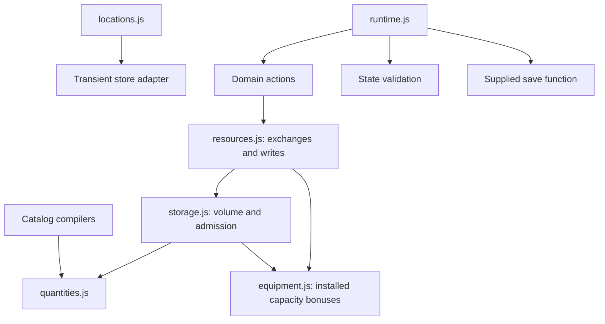

# Volumetric Storage — Implementation Plan

Status: implemented on 2026-09-26 after approval to proceed. The section 11 values are the initial shipped balance, with frozen legacy conversion factors. Explicit-amount discard with confirmation is included. The sections below retain the design rationale; section 14 records implementation and validation.

## 1. Confirmed direction

- Raw materials (`resource` category) are measured directly in cubic metres (m³).
- Components and products are primarily counted, with an authored cargo volume per item.
- Each fixed site and ship has its own shared volumetric storage capacity.
- Storage is a reusable subsystem of locations. Ships already are mobile locations and use the same subsystem.
- Include deliberate discard of stored cargo, with an explicit amount and confirmation, as an overload recovery action.

This document records the implemented design. Volumes are gameplay packing values, not physical specifications.

## 2. Pre-feature baseline and integration points

| Existing system | Current behavior | Consequence for this change |
| --- | --- | --- |
| `js/content.js`, `js/itemCatalog.js` | Every item has an independent `baseCapacity`; items and power share the derived resources index. | Replace physical-item caps with quantity semantics and per-item volumes; retain separate utility capacities. |
| `js/locations.js` | Each location owns resources and infrastructure. Location types merge starting assets and per-resource capacity overrides. Areas default to zero capacity. | Add one cargo capacity to site/type definitions and resolve it through the existing local context. |
| `js/ships.js` | Ships retain the same location record throughout boarding, docking, and travel. | No ship inventory registry or cargo copying is needed. |
| `js/resources.js`, `js/equipment.js` | Quantity/payment helpers serve items and power; `receive` clips each reward to its separate cap. Equipment owns passive capacity calculation. | Keep resources as the exchange owner, delegate cargo admission to storage, and retain equipment ownership of installed bonuses. |
| `js/crafting.js` | Checks output caps individually; only credits consumption of that same output ID. Ingredient requirements round up to whole items. | Check the total projected cargo volume, and distinguish bulk quantities from item counts. |
| `js/itemActions.js` | Gathering, installation, operations, repairs, and upgrades use the crafting transfer helpers. | Integrating the shared transaction calculation covers most physical inventory mutations. |
| `js/research/researchActions.js` | An experiment consumes exactly one of every selected item ID. | Bulk resources need explicit sample volumes; counted items can retain one-item samples. |
| `js/npcs.js` | NPC inventories are private and have independent per-item limits. | Convert their raw-material quantity units consistently without introducing NPC cargo access. |
| `js/game.js`, `js/runtime.js` | The visible-time simulation updates power at every location; runtime orders production, journeys, contact reconciliation, and commits. Material production is not continuous. | No material tick loop or runtime storage phase is needed. |
| `js/stateCore.js`, `js/state.js`, `js/app.js`, `js/save.js` | `stateCore` owns version-six validation/migration; `state` is a compatibility facade. App loads saves; runtime owns action copy → execute → reconcile → validate → save → commit. | Put version-seven migration in the state lifecycle and preserve the runtime transaction boundary. |
| Inventory/transfer/research displays | Item quantities assume whole numbers; inventory shows a separate maximum per item. | Use unit-aware formatting, one cargo summary, and bulk transfer input. |

Production content currently has no ship instance. Ship verification must continue using test-defined vessels; adding a starter ship is a separate content decision.

## 3. Recommended first version

### One shared hold per site or ship

Use one cargo pool that accepts all physical resources, components, and uninstalled products. Space used is:

**Used cargo volume = sum of bulk material volumes + sum of (item count × item volume).**

For example, 0.120 m³ of scrap, eight components at 0.005 m³ each, and two products at 0.030 m³ each occupy 0.220 m³. A 0.500 m³ hold has 0.280 m³ free.

This removes individual material quotas. A player can fill a hold with one resource or divide it among many items. Adding a new item no longer creates additional effective storage capacity at every location.

Power remains an independently capped utility. Installed battery banks continue to increase power capacity without changing cargo capacity.

Treat an item's volume as its standard occupied cargo volume, including ordinary packing/handling allowance. Do not simulate geometric packing or convert between loose, compressed, and solid volume in this release. Recipe input and output volumes do not need to match: occupied space is not a mass-conservation model.

### Stored versus installed equipment

Uninstalled products occupy cargo space. Installing one consumes one counted product and frees its cargo volume; the installation remains in the existing infrastructure map.

Define cargo capacity as usable cargo space after normal installed facilities, rather than a ship's entire internal hull volume. This keeps the current equipment system compatible. Interior layout, mounting space, and installation limits remain distinct concerns.

Support an optional installed `storageBonusM3` through the existing definition-driven equipment mechanism. This means an authored net addition to usable cargo volume, such as an external cargo module. Merely carrying that product grants no bonus. As with current passive capacity bonuses, installed count determines capacity, independent of enabled state or health. No new expansion item needs to ship with the engine change.

### Extension choices

| Idea | Recommendation |
| --- | --- |
| Multiple holds, liquid tanks, gas tanks, refrigerated storage | Add later when there is content requiring incompatible storage. One shared pool best serves the present simplification goal. |
| Mass, density, acceleration, fuel effects | Independent future systems. Volume alone cannot establish cargo mass. |
| Connected warehouses or automatic remote crafting inputs | Add later as explicit logistics behavior. Nearby stores stay independent. |
| Timed manufacturing and reserved output space | Add when jobs exist. Immediate crafting needs a final-state check, not reservations. |
| NPC backpacks and trade | Future consumers of the same storage arithmetic; no new access or trading behavior in this change. |
| Capacity damage, demolition, uninstalling | Separate mechanics with explicit recovery rules. Do not add them to this release. |
| Discarding stored cargo | Include a minimal explicit discard action with amount and confirmation for overload recovery; see section 7. Approved during this planning review. |

## 4. Data and numerical contracts

### Authoring model

| Definition | Proposed contract |
| --- | --- |
| Raw resource | Category determines that quantities are m³. No per-item volume or physical `baseCapacity`. Explicit `researchSampleM3`. |
| Component/product | Positive `unitVolumeM3`; quantities and yields remain whole counts. |
| Location/type | `storage.capacityM3`, nonnegative; a site's explicit value overrides its template value. Zero is valid. |
| Area | Zero cargo capacity and no physical contents. Areas remain navigation containers. |
| Utility | Existing utility capacity and quantity behavior. Location `capacities` becomes utility-only. |
| Installed infrastructure | Optional positive `storageBonusM3`; existing `capacityBonus` becomes utility-only. |
| Acquisition, exact recipe input, operating cost, starting inventory | Amount is m³ for a resource, count for a component/product, or the utility's existing unit. |

Require every site type or site to resolve a cargo capacity explicitly. Do not infer it by summing obsolete item caps. Validate volume fields, starting load, and references during catalog compilation. Reject legacy physical capacity fields in new definitions so stale settings cannot silently do nothing.

### Exact internal arithmetic

Recommended resolution: **0.000001 m³ (one cubic centimetre)**. Authors and players use m³; compile bulk amounts, item volumes, capacities, and storage bonuses into integer volume units. Bulk inventory stores these integer units; component/product inventory stores integer counts. Power retains its existing fractional arithmetic.

- Convert at content/UI boundaries, not repeatedly during gameplay.
- Use a single parser/normalizer for decimal volumes. Reject values finer than the supported resolution rather than silently truncating them.
- Check safe-integer bounds for quantities, products of count and volume, sums, and bonuses.
- Counted items must have a positive volume. Unknown IDs, negative amounts, NaN, infinity, and fractional counts remain invalid.
- Display enough m³ precision that positive amounts never appear as zero; strip unnecessary trailing zeroes.
- Do not print internal volume units as item counts or m³.

Use explicit names at the boundary: authored `capacityM3`, `unitVolumeM3`, `researchSampleM3`, and `storageBonusM3` compile to `capacityVolumeUnits`, `unitVolumeUnits`, `researchSampleVolumeUnits`, and `storageBonusVolumeUnits`. Quantity maps used by gameplay contain compiled quantities only. Preserve authored values separately only when needed; never reconvert a compiled catalog.

Define a small `js/quantities.js` module for parsing, quantity-kind validation, formatting, checked arithmetic, and role ratios. Both catalog compilation and storage can import it without importing default content or worlds. `storage.js` then stays focused on occupied volume and admission.

Parse player bulk input from its decimal string, before `Number(...)` conversion. Accept trimmed base-ten decimal notation with `.` as the separator; reject blank values, negative amounts, ambiguous separators, exponent notation, and values not exactly expressible at the quantum. Trailing zeroes beyond six decimal places are acceptable when the value is exact. Authored numeric literals may be normalized from their canonical decimal representation, including exponent expansion, with no tolerance-based rounding. Computed floating-point values such as `0.1 + 0.2` are not valid authoring shortcuts.

Use checked integer arithmetic for stored quantities and totals. Temporary `BigInt` calculations are suitable for decimal parsing, multiplication, and ceiling division, followed by a safe-integer bounds check before returning ordinary numbers. Never persist `BigInt`. A direct gameplay call accepts internal quantities only; it must not guess whether a number represents m³ or internal units.

For transfers, retain `amount` as the internal quantity in the action payload. The form uses the shared parser to produce it, and the action validates it again. Expose the parser for scripted callers and document this breaking change. Physical transfers require a positive safe integer; power retains positive finite fractional amounts. An empty cost/reward map is valid, zero costs are safe no-ops, and zero-yield authored gathering/sample definitions are invalid.

The exact resolution should be locked before migration data is finalized. Changing it afterward requires another migration.

### State ownership

For the first implementation, retain `locations[id].resources` as the single saved quantity map. Its physical entries use the new quantity rules; utilities keep their existing meanings. The subsystem does not need a second saved copy of inventory.

Expose a transient storage context through `getLocationContext`, referencing the same local resources and infrastructure plus the compiled capacity definition. Compute capacity, occupied volume, free volume, and overload from that context. Do not save derived totals or retain contexts across state commits.

This provides a real storage subsystem without simultaneously restructuring every asset consumer. A future separation of physical inventory and utility state should be an independent migration, if needed.

## 5. Shared storage operations

Keep the dependency direction explicit:

None of the low-level modules import default content, locations, the browser, or runtime. `resources.js` remains the sole owner of gameplay quantity-map writes; initializers and explicit migrations may construct/convert those maps. `equipment.js` remains the owner of installed equipment and supplies a checked passive cargo-bonus query. The subsystem requires no registration framework, second inventory, or new simulation step.

Create `js/storage.js` as a DOM-free, location-independent, read-only module operating on an explicit store context. Proposed responsibilities:

- Calculate volume for one inventory entry and the whole inventory.
- Calculate effective capacity from base capacity and installed storage bonuses.
- Return a summary containing capacity, used volume, free volume, and overload.
- Assess a complete projected physical inventory, including projected volume and a structured rejection reason.
- Calculate maximum receivable amount: remaining volume for bulk material, or floor(free volume / unit volume) for counted items.

`quantities.js` owns kind/unit descriptions and conversion/formatting. `resources.js` builds the complete exchange preview, validates quantities and affordability, checks utility limits, calls storage admission, and applies the result. Do not give both storage and resources independent mutation paths.

Recommended interfaces, with final names adjustable during implementation:

| Module | Operation | Contract |
| --- | --- | --- |
| `quantities.js` | `parseQuantity`, `formatQuantity`, `formatVolume` | Resolve the item kind from explicit content; convert only at boundaries. Volume output is derived from integer quotient/remainder so the last quantum is not rounded away. |
| `storage.js` | `storageSummary(store, content)` | Return `{ capacityVolumeUnits, usedVolumeUnits, freeVolumeUnits, overloadVolumeUnits }`; free and overload are nonnegative. Utilities contribute no cargo volume. |
| `storage.js` | `assessStorageChange(before, after)` | Check the admission rule using complete before/after summaries. Pure; no mutation. |
| `storage.js` | `maxReceivable(store, itemId, content)` | Return an internal bulk amount or whole count; zero when full/overloaded. This is an upper bound for a pure receipt, not for crafting that also frees space. |
| `resources.js` | `previewExchange(store, cost, rewards, content)` | Return success/failure, resulting quantities, before/after cargo summaries, and structured errors such as invalid amount, insufficient stock, cargo full, utility full, or arithmetic overflow. |
| `resources.js` | Existing `transferReason`, `transfer`, `pay` | Wrap the same exchange calculation. `pay` is an exchange with no rewards. `transfer` recomputes against the live candidate rather than trusting a UI preview. |
| `resources.js` | `receiveUtilityClamped` | Accept utility IDs only, preserve passive saturation, and reject accidental physical inputs. Replace the generic clipping call in `game.js`. |
| `resources.js` | Existing `moveReason`, `moveExact` | Preview debit and credit completely before writing either endpoint. |

Keep `capacity(store, id, content)` utility-only and reject physical IDs with a useful error. Do not reinterpret it as a physical maximum: that would hide stale callers and confuse an item's held amount with free shared space. Update existing tests/custom callers and retain the crafting compatibility re-exports for the exchange helpers.

The transient store gains a compiled base cargo capacity alongside its existing resources, infrastructure, and utility capacities. `actionState` includes the same storage inputs for previews, but no independent saved totals. Read equipment bonuses live so an existing context sees installations made earlier in the same candidate.

Keep ownership, known-location checks, same-area rules, journey restrictions, and action assignment in their existing domain modules. Arithmetic helpers do not grant access.

### Atomic changes

For gathering, crafting, and other actions:

1. Validate amount units and aggregate duplicate ingredient/reward IDs.
2. Check all costs against the original inventory.
3. Compute all resulting quantities, then total occupied volume.
4. Check cargo fit and independent utility limits.
5. Apply the complete change through the existing saved action transaction.

Check affordability before netting costs and rewards: an action cannot fund its input with its own output. Aggregate recipe slot costs using checked addition, including repeats across explicit costs and selected ingredients. Only write after every resulting quantity and summary has passed validation. A physical rejection also rolls back any power cost; a utility-capacity rejection also rolls back physical inputs and rewards.

For installation, preview the product debit and the projected equipment installation together. Check the installation limit, count overflow, weighted-health update, utility capacity, and cargo bonus before mutation. The current debit-then-install sequence works for most ordinary cases, but previewing the combined effect prevents the UI from promising an installation whose derived capacity would overflow. Apply debit and equipment update within the same runtime candidate; subsequent operations see the new capacity.

Inputs may free space for outputs of different item types. A full hold can therefore craft something smaller. If the final contents do not fit, nothing is spent or produced.

Do not reuse reward-by-reward clipping for physical cargo. Admission must not depend on the order of reward keys, and a manual action must not silently lose output. Preserve utility clamping for passive power generation as a separate operation.

Cross-location transfers check both endpoints before mutation, transfer the exact amount, and commit both changes together. Preserve the current known/owned/same-area/current-endpoint restrictions and the ban on transfers during journeys. Docking does not become a new cargo-transfer requirement.

Reject equal endpoints, including the same underlying resource map at the low-level move boundary. The displayed transfer maximum is `min(source quantity, destination receivable quantity)`, in the asset's quantity unit. Never silently shrink a requested amount to that maximum. Stale previews, ownership changes, departure, and intervening storage use are rechecked by the executing action. Access checks precede private inventory/capacity diagnostics.

For power, calculate receiving space from its utility cap instead of `maxReceivable` for cargo. Preserve the current too-small-to-change-either-balance guard for fractional power transfers and reject nonfinite arithmetic. Exact bulk quantities do not require a floating-point tolerance.

## 6. Crafting and research integration

### Recipe quantities and substitutions

Keep existing category rules, recipe IDs, discoveries, equipment requirements, and approved substitutions.

- Exact resource inputs specify m³ and compile directly to bulk volume units.
- Exact component inputs specify whole counts.
- Component/product outputs remain whole counts; their cargo effect comes from item metadata.
- Counted role ingredients retain contributions per item and upward rounding to whole items.
- For a resource approved for a role, define its contribution explicitly per m³, with a clearly named field such as `unitsPerM3`. Do not reuse an unexplained per-item contribution for bulk material.
- Round role-based bulk requirements upward only to the supported volume quantum. Use validated ratios and checked arithmetic so the result always satisfies the contribution requirement.
- Continue aggregating consumption across slots so one quantity cannot satisfy multiple requirements.

Volume answers whether output fits. Role contributions answer whether ingredients can perform the recipe's function. Do not infer substitution quality from occupied volume.

For the first version, keep role slot demands and counted contributions as positive safe integers. Allow `unitsPerM3` as an exact positive decimal compiled to a rational numerator/denominator. A bulk requirement is `ceil(requiredRoleUnits × 1,000,000 × denominator / numerator)` volume units. Perform the intermediate calculation exactly and bounds-check the result. Bulk approvals must not inherit the current `units = 1` default; reject mixed `units`/`unitsPerM3` fields. Exact bulk slots must not pass through the current unconditional `Math.ceil` in `ingredientOptions`.

Example: a 0.500 m³ hold containing 0.490 m³ can consume 0.040 m³ of scrap and produce one 0.005 m³ structural component, ending at 0.455 m³. An output that instead leaves 0.510 m³ must be rejected without spending ingredients.

### Research samples

Use each raw resource's authored `researchSampleM3`; counted components/products continue to consume one item. Replace the hard-coded `+1` cost and the UI's `amount < 1` rule with the same sample-quantity helper.

Keep one to three distinct selected item IDs, evidence profiles, diminishing returns, randomness, and journal identity rules intact. Research strength remains based on the selected sample identities, rather than increasing automatically with sample volume.

For the initial conversion, make one resource sample equal one legacy resource unit's converted volume. This preserves the opening research effort. Existing journals store item IDs rather than consumed quantities, so they do not need fabricated historical volume entries.

## 7. Save migration and overload recovery

Introduce save version seven. Preserve older supported versions through a deliberately ordered migration chain.

1. Validate and migrate older structural schemas using their legacy rules. The current version-three path calls `validateLocalState` before completing migration; it must not call the new-unit validator on unconverted inventory.
2. Convert each pre-version-seven raw material count using a frozen per-resource legacy-unit-to-volume table. Preserve component/product counts, utilities, equipment, ownership, flags, knowledge, NPC locations, and ship journeys.
3. Convert NPC raw inventory and authored private limits consistently, despite NPC transfers remaining unavailable. Do not mix old raw counts with new raw volumes for the same item ID.
4. Ensure newly added locations/items/NPCs initialized from current content are not converted a second time. Distinguish pre-existing legacy records from newly initialized records, or perform their initialization after conversion.
5. Validate the new schema, issue a migration notice, and save through the existing lifecycle. Failed conversion must preserve the original save.

Concrete migration structure:

- Keep `migrateState` in `stateCore.js`; add a focused `storageMigration.js` helper for the frozen conversion descriptor and conversion arithmetic. `state.js` stays a compatibility facade. Explicit-catalog tests must be able to supply a matching legacy descriptor; do not make `stateCore` import production bootstrap to obtain one.
- Capture provenance from the original save before adding defaults: versions 1–2 have a legacy root resource map destined for Habitat 05; versions 3–6 have existing local resource maps; versions 5–6 also have existing NPC inventory maps. Missing fields and newly initialized records are not legacy stock.
- Preserve the existing older structural upgrades, area-to-site mapping, equipment defaults, research grants, and dialogue reconciliation. Separate legacy shape/quantity checks from version-seven validation. Specifically replace the version-three call to `validateLocalState` with a legacy-aware check rather than deleting its corruption checks.
- Validate old physical amounts as nonnegative safe integer counts and old utilities under their old units. Preserve historical cap checks using a frozen legacy descriptor of item caps, local overrides, and passive bonuses, not the new cargo capacities. Validate references and infrastructure before using them to calculate a limit. Explicitly supported custom legacy content needs its own descriptor; an unknown legacy raw ID must fail rather than receive a guessed factor.
- Convert only quantities identified as legacy, using the frozen integer `volumeUnitsPerLegacyUnit` map and checked multiplication. The table covers every supported historical raw ID. Components and products retain counts. Treat a later category change or renamed/removed asset as a separate explicit migration, never an inferred conversion.
- Newly introduced sites use current compiled starting inventory once. New items at an existing site remain zero, matching current behavior. NPCs added by the version-four upgrade or by content reconciliation use current compiled starting inventory once. Convert existing NPC records **before** `reconcilePeopleContent`, which calls `validateNpcState` internally.
- Finish reconciliation, mark version seven, and run the aggregate current validator. Keep the caller's save object unchanged on success and failure. Migration notices are returned data and are published only after loading succeeds.
- `app.js` currently does not save directly in `loadOrCreateGame`. Add persistence of a successfully validated version upgrade before returning it as the running state. If that write fails, retain the old localStorage value and use the existing load-failure path; do not start a fresh game or announce success. Keep the same save key. Normal version-seven loads need no conversion write.

Freeze real pre-change fixtures before updating test factories. Relabeling a new-unit state as version six would create a misleading migration test and conceal double conversion. Include literal versions 1–6, an active ship journey, NPC stock, and research RNG/journal/history.

Freeze conversion factors in migration metadata; do not derive them from mutable gathering yields, research samples, or recipe costs. Applying migration to a version-seven save must be idempotent.

Illustrative conversion: if one old scrap unit represents 0.010 m³, seven saved scrap units become 0.070 m³, gathering one old unit becomes 0.010 m³, and the existing four-scrap recipe consumes 0.040 m³. Component counts remain unchanged. These factors require a content balance pass.

### Recommended overload policy

An old inventory may fit every old item cap while exceeding the new shared capacity. Preserve it and show an explicit overloaded state. Do not discard items, invent extra permanent capacity, or refuse an otherwise valid save solely for that reason.

- For ordinary stores, projected occupied volume must be at most the resulting capacity.
- For already overloaded stores, an action may proceed when the final contents fit the resulting capacity **or** projected occupied volume is no greater than its starting occupied volume. Use resulting capacity so an installation can actually resolve overload.
- Incoming cargo therefore remains blocked until it fits; outgoing transfers, consumption, installation, and non-expanding crafting can recover the store.
- Power behavior remains independent.
- State validation permits well-formed overloaded contents; action admission prevents creating or worsening overload. Fresh authored starting inventories must fit.

The same rule also provides a predictable recovery path after a later deliberate content capacity reduction. Display overload as a warning, not as a permanently increased capacity. Changes to existing item volumes still need explicit balance review because they change occupied space in saved inventories.

Formally, for used volumes `U0`, `U1` and capacities `C0`, `C1`, admit when `U1 <= C1 || (U0 > C0 && U1 <= U0)`. All current capacity mutations are nonnegative installation bonuses. Future capacity-removal mechanics must define their own recovery policy before using this rule. A same-volume exchange in an overloaded hold is allowed, even though a pure incoming transfer is blocked. Utility-only actions, navigation, and dialogue remain available subject to their existing requirements.

Zero-capacity sites can remain valid with overloaded legacy stock and permit recovery actions. Areas are different: explicitly require empty physical inventories and no cargo capacity or cargo-expanding infrastructure on areas. The overloaded-save exception must not accidentally turn navigation containers into warehouses. Check fresh starting loads using effective capacity including initially installed storage, without the migration overload exception.

NPCs remain private per-item stores for this release. Compile their raw inventory and private per-item limits to volume units; retain the existing per-item limit invariant and no transfer access. The site overload policy does not silently relax NPC validation. A future reduction of an NPC private limit needs a separate explicit migration policy.

### Recovery gap and approved discard action

Preserving excess stock is necessary but is not a guaranteed recovery mechanic. Research can reject an uninformative experiment without consuming anything; products cannot be recipe ingredients; an antenna may already be at its installation limit; every reachable owned destination may be full. An isolated test ship can have no usable destination at all. Therefore the original proposal's recovery promise is incomplete without a way to remove cargo deliberately.

Include `discardCargo` for a specified physical asset and amount at the current owned site/ship. Show the exact amount and occupied volume to be removed, require an explicit confirmation in the interface, then use the ordinary synchronous action transaction and `pay`. Require positive valid quantities and sufficient stock at execution. Do not target installed equipment, power, NPC stock, or remote stores; do not grant rewards. Allow it aboard an owned ship during a journey so recovery does not depend on another destination. A failed save leaves cargo intact. Clear a pending confirmation when the site, item, or amount changes, and recheck all requirements on execution. No timer, salvage object, demolition, or uninstall system is needed.

The user approved this scope addition during the planning review. Include the source location ID and an explicit confirmation flag in the committed payload so a changed current location or an ordinary terminal command cannot discard implicitly. Bind the confirmation to the displayed asset and amount, clear it after success, and prevent duplicate submission. No saved confirmation state is needed. Never discard anything automatically during migration.

## 8. Presentation

- Workshop: one local cargo summary, for example Habitat 05's `Cargo: 0.220 / 10.000 m³ · 9.780 m³ free`.
- Raw-material rows: `Metal scrap — 0.120 m³`.
- Counted rows: `Structural parts — 8 · 0.040 m³ total`; show per-item volume in supporting detail.
- Crafting preview: unit-aware ingredients/output plus current and projected storage use, or net volume change.
- Transfer form: m³ amounts for resources, whole counts for manufactured items, and existing fractional power input. Show transferable maximum and receiving space.
- Research: show exact sample consumption and available amount in appropriate units.
- Locations/ships: show cargo summaries only where existing ownership rules permit inventory information. Clear summaries along with other private passenger controls.
- Overload: show amount over capacity and explain that reducing cargo restores receiving ability.
- Discard: show the selected asset, exact removal amount and volume, with distinct confirm/cancel controls. Label the confirmed action as permanent removal; never automatically choose an amount on the player's behalf.

Use the same formatter and admission preview in all displays. Avoid rounded displays that say an action fits when the exact calculation rejects it.

## 9. Ordered implementation work

| Step | Files/area | Deliverable and completion condition |
| --- | --- | --- |
| 1. Freeze compatibility and content decisions | Historical save fixtures; conversion descriptor; `content.js`, `locationContent.js` design | Capture real old-unit fixtures before changing factories. Choose conversion factors, packed item volumes, samples, and site capacities. Include the approved discard behavior. |
| 2. Build exact quantity and cargo queries | New `quantities.js`, `storage.js`; equipment passive cargo query; new `tests/storage.test.mjs` | Pure parsing, formatting, safe arithmetic, summaries, admission, and receivable maxima pass boundary tests using explicit fixtures. |
| 3. Compile new content and contexts | `itemCatalog.js`, `locations.js`, `npcs.js`; item/location/NPC definitions | Convert all authoring fields once, reject obsolete physical caps, attach compiled cargo capacity, validate fresh starting loads, and retain utility units. |
| 4. Implement complete resource exchanges | `resources.js`, `game.js`, `crafting.js`, `itemActions.js`, location transfers | One exact exchange path, checked ingredient aggregation, separate passive utility clipping, combined installation previews, and atomic two-store moves. |
| 5. Integrate research and recovery | Research actions/view; current-site discard action | One sample helper shared by preview, execution, and UI; preserve evidence/RNG behavior. Prove recovery from a hold full of otherwise unusable products. |
| 6. Complete version-seven lifecycle | `stateCore.js`, new migration helper, `app.js`, `save.js` integration | Versions 1–6 convert once; new records avoid conversion; v7 reload is idempotent; migration saves before startup success; malformed/save-failure cases preserve the old save. |
| 7. Finish presentation and documentation | Crafting/transfer/location/research displays; HTML/CSS; authoring guides and architecture | Exact units, cargo and overload summaries, transfer maxima, privacy clearing, explicit discard confirmation, and updated API examples. |
| 8. Verify release behavior and balance | All unit suites and isolated-save browser suite | Opening loops, smaller/larger ships, all-old-caps-full migration, decimal inputs, stale previews, persistence failure, and mobile/desktop flows pass. |

Steps are implementation order, not individually compatible releases. Integrate and ship the quantity conversion, consumers, and migration together.

Update `CONTENT_AUTHORING.md`, `LOCATION_AUTHORING.md`, `SHIP_AUTHORING.md`, `NPC_AUTHORING.md`, `RESEARCH_AUTHORING.md`, `README.md`, and `ARCHITECTURE.md` as part of implementation. Examples must distinguish authored m³ from saved internal quantities and remove obsolete per-item cargo limits. Update the architecture's retained-version statement only when the feature is implemented. Audit the personal item-authoring skill for follow-up consistency; repository changes do not automatically update an installed external skill.

## 10. Acceptance checks

- Mixed materials/components/products share one cap; sites and ships remain independent.
- Adding a catalog item does not enlarge any hold; adding a site or ship needs only normal content metadata.
- Exact-fit cargo succeeds; one volume quantum too much fails; fractional counted items fail.
- Repeated fractional bulk transfers conserve inventory exactly, including across save/reload.
- Cross-item consumption frees output space; repeated ingredient IDs are aggregated correctly.
- Multiple rewards cannot bypass the cap or partially arrive depending on iteration order.
- Whole-item and bulk-role rounding respect their respective units.
- Full and overloaded stores can consume/reduce cargo; expansion is blocked appropriately.
- Discard requires an explicit confirmed amount, works for otherwise unusable stored products, and cannot remove remote/private/installed assets or power. Cancel, stale location, duplicate UI submission, and save failure are safe.
- Installing a product removes its cargo volume; only installed expansion equipment adds capacity.
- Battery capacity, passive power saturation, disabled/damaged passive storage behavior, and ship travel power remain correct.
- Both transfer endpoints remain unchanged on validation or save failure; stale previews are rechecked.
- Research consumes the authored sample volume and retains existing discoveries/evidence progression.
- Legacy raw inventory converts exactly once, including NPC holdings; journals and journeys survive.
- New content initialized during legacy migration is not converted or granted twice.
- Unowned/passenger views reveal no cargo quantities, totals, capacity-derived contents, or actionable transfer controls.
- Unit bounds, malformed metadata, removed IDs, and invalid saved quantities produce clear errors.
- Desktop/mobile inventory, crafting, research, and transfer controls display consistent units.

Verification results are recorded in section 14; browser checks use isolated saves.

## 11. Initial balance

The implementation uses the values below for:

1. Legacy volume represented by one old unit of each raw resource.
2. Cargo volume per existing component/product, including packed panels, antennas, and battery banks.
3. Usable cargo capacity for Habitat 05, the supply platform, derelicts, and the ship template.

Recommended tuning method: preserve the number of gathering actions and research samples needed for the current opening loop, then tune capacity to a meaningful number of fabrication batches. Make the supply platform substantially larger than the habitat if it is intended to support stockpiling. Use a smaller ship fixture and a larger freighter fixture to verify that volume creates a useful logistics distinction.

### Adopted starting values

These gameplay values were adopted when implementation was authorized. Migration factors are now frozen independently of current balancing. Research sample volume initially equals gathering yield and the converted volume of one legacy unit.

| Raw item | m³ per legacy unit / gathering action / research sample | Internal units per legacy unit |
| --- | ---: | ---: |
| `scrap` | 0.010 | 10,000 |
| `electronicSalvage` | 0.005 | 5,000 |
| `siliconMinerals` | 0.010 | 10,000 |

| Counted item | Packed m³ per item |
| --- | ---: |
| `iron` | 0.005 |
| `conductiveParts` | 0.002 |
| `electronicParts` | 0.001 |
| `solarCells` | 0.002 |
| `solarPanel` | 0.030 |
| `batteryBank` | 0.025 |
| `radioAntenna` | 0.010 |

| Site/type | Base cargo capacity m³ |
| --- | ---: |
| Habitat 05 / habitat type | 10.000 |
| Supply platform / platform type | 2.000 |
| Derelict type | 0.250 |
| Ship type / small ship fixture | 0.200 |
| Large freighter fixture override | 2.000 |
| Areas | 0 |

The ship values are storage test fixtures; this feature does not add a production ship. Capacity inheritance is deterministic: an explicit site value, including zero, overrides its type; a missing site value inherits the type. An unresolved site capacity is an error. An area's absent capacity resolves to zero and any nonzero value is rejected.

With these values:

- A structural-parts batch consumes 0.040 m³ of scrap and produces one 0.005 m³ part, freeing 0.035 m³. The repair still needs two parts and eight salvage actions for their raw material, plus the existing research effort. Research action counts do not change.
- Conductive parts consume 0.025 m³ and produce 0.002 m³; electronic parts consume 0.010 m³ and produce 0.001 m³; solar cells consume 0.021 m³ and produce 0.002 m³.
- Panel assembly changes 0.016 m³ of components into a 0.030 m³ product, requiring 0.014 m³ extra room. Battery assembly requires 0.011 m³ extra; antenna assembly requires 0.002 m³ extra. Test these expanding recipes as well as shrinking fabrication. Their stored product must fit before installation; do not borrow capacity from an uninstalled product or introduce implicit craft-and-install.
- Filling every current physical per-item cap would occupy 2.150 m³: 1.200 m³ of raw material, 0.300 m³ of components, and 0.650 m³ of products. Migration preserves that stock; the 10.000 m³ Habitat 05 hold now accommodates that historical maximum without overload.
- Mira's four legacy scrap units become 0.040 m³, and her private twenty-unit scrap limit becomes 0.200 m³. This inventory remains separate from Habitat 05 cargo.

Do not choose site capacities by summing old caps. Measure peak occupied volume during the existing deterministic, zero-power/no-lucky-bonus opening scenario, and ensure that planned gathering batches and the first required products are achievable. The deterministic opening route passes with a measured peak of 0.285 m³ in the 10.000 m³ habitat. Longer-term capacity tuning remains a gameplay balance choice.

## 12. Verification ownership and edge-case matrix

Capture fixtures first, add focused checks with the relevant implementation step, then run the full suites once the coordinated change is complete. Rewrite old per-item-cap assertions to test shared capacity; preserve their original behavioral intent (rollback, live equipment capacity, locality, and no lost rewards). Do not weaken those checks just to accommodate changed numbers.

| Area / primary test file | Required scenarios |
| --- | --- |
| Exact quantities / new `tests/storage.test.mjs` | Parse and round-trip one quantum, trailing zeroes, supported authored exponent literals, maximum safe values; reject finer-than-quantum values, fractional counts, negative/NaN/infinite inputs, malformed objects, and unsafe products/sums. Role ceiling division must satisfy the demand, while one less quantum does not. |
| Shared storage / new `tests/storage.test.mjs` | Mixed cargo, zero quantities, power exclusion, exact fit, one quantum over, unknown IDs even with zero stock, empty holds, no free-capacity growth from new catalog items, no mutation on failure, and reward-key order independence. |
| Complete exchanges / `tests/crafting.test.mjs`, `tests/refactor.test.mjs` | Costs are affordable before rewards; repeated ingredients aggregate; cross-item consumption frees space; all rewards fit together; shrinking/same-volume/expanding crafting when full and overloaded; physical and utility failure both leave the entire exchange unchanged. Preview is pure and consumes no RNG. |
| Equipment / `tests/crafting.test.mjs`, `tests/locations.test.mjs` | Carried products occupy space and grant no bonus; installation debits exactly one, frees volume, and adds passive capacity immediately through an existing context. Disabled/zero-health equipment retains passive capacity; battery power capacity stays independent. Installation-limit or capacity-arithmetic overflow rejects the whole action. |
| Catalogs / `tests/crafting.test.mjs`, `tests/locations.test.mjs`, `tests/dialogue.test.mjs` | All new item kinds, quantities, role fields, acquisition/operation costs, private NPC limits, and starting inventories compile once. Reject stale physical `baseCapacity`, `capacities`, and `capacityBonus` fields; missing/nonpositive volumes; unresolved sites; overloaded fresh content; and cargo on areas. Validate zero overrides and template independence. |
| Transfers / `tests/locations.test.mjs`, `tests/refactor.test.mjs` | Repeated fractional-m³ transfers conserve exact bulk units through JSON reload; item maximum floors to whole counts; source/destination aliasing rejects; requests never partially fill. Preserve current-endpoint/known/owned/same-area/journey restrictions and fractional power behavior. Recheck stale capacity/access and roll back both stores on save failure. |
| Recovery / new storage tests plus action/runtime tests | Overload is valid saved state; pure receipt is blocked; consumption and same-volume exchanges work; expansion is allowed only if final contents fit. An isolated owned ship full of unusable antennas can recover by confirmed discard. Cancellation, missing confirmation, changed location, wrong amount units, insufficient stock, remote/private targets, and failed save do not remove cargo. |
| Research / `tests/research.test.mjs`, `tests/refactor.test.mjs` | Exactly one authored bulk sample versus one counted item; one quantum below the sample rejects; the UI and execution agree. Sample IDs/evidence/strength/journal stay unchanged. Failed experiment commits roll back sample quantities, power, discoveries, journal, and RNG. Completed evidence cannot be treated as a disposal route. |
| Migration / new `tests/storageMigration.test.mjs` plus existing migration tests | Literal old-unit versions 1–6, each raw conversion, old caps all full, v3 area relocation, v4 NPC introduction, v5 research grants, existing versus newly added sites/NPCs/items, partial missing asset fields, active journey, private inventory, and v7 idempotence. Reject unknown historical factors, invalid legacy counts/caps, removed IDs, category changes without mappings, conversion overflow, and newer unsupported versions. Source objects remain unchanged. |
| Startup persistence / isolated-save browser suite | Valid old save becomes persisted v7 before startup success. Invalid JSON, failed conversion, and failed localStorage writes retain the previous saved data and do not start a reset game. Successful reload does not reapply grants/conversion or repeat the version-upgrade notice. |
| Ships and simulation / `tests/ships.test.mjs`, `tests/locations.test.mjs`, `tests/refactor.test.mjs` | Different capacities on two ships; boarding/docking/arrival retain the same store; cargo does not change propulsion or journey power; overloaded ships can travel under existing rules. Power remains clamped during full/overloaded cargo and retains production → arrival → contact ordering and rollback. |
| Presentation / `tests/terminalTabs.browser.mjs` | Desktop/mobile cargo totals, overflow warning, exact positive fractions, ingredient/research costs, decimal transfer input, asset switching, maximum refresh, keyboard access, explicit discard confirmation/cancel, and pending-draft cleanup. A switch from owned inventory to an unowned passenger view clears totals, tooltips, input maxima, previews, and confirmation data without leaking private values. |
| Opening balance / `tests/research.test.mjs`, `tests/locations.test.mjs` | Preserve the zero-power/no-luck route to structural fabrication, repair, battery storage, panels, and radio. Measure peak cargo during real gathering/crafting/research actions instead of injecting impossible stocks. Retain targeted injected-stock fixtures for overload and numerical boundaries. |

Release checks: `node --test tests/*.test.mjs` and `node --test tests/terminalTabs.browser.mjs` with Playwright available and isolated saves. The full suites passed after implementation; see section 14.

## 13. Implementation boundaries

- Deliver the quantity conversion, content, consumers, migration, and UI together. Intermediate commits may aid review, but do not release a mode that mixes old raw counts with new volume units.
- Keep one saved resources map per location and the existing NPC inventory map. Do not store derived cargo totals, transfer previews, confirmation dialogs, or cached contexts.
- Do not introduce mass, fuel effects, packing geometry, compartment allocation, remote crafting, NPC trade, offline production, or a production starter ship in this change.
- Counted item volume changes and capacity reductions can create overload on a later content update. The validator and recovery action must remain valid for that case. Category/unit changes and changes to the quantum require explicit migration, not only a balance edit.
- Existing custom content that uses physical caps must adopt the new authoring schema. Supporting a custom legacy save requires explicit historical conversion metadata; never derive migration semantics from mutable current yields or sample sizes.
- The numerical table in section 11 is the initial implemented balance. Future tuning must preserve the frozen conversion descriptor and review changes to occupied cargo in existing saves.

## 14. Implementation and validation record

Implemented the coordinated version-seven release: exact quantities and cargo queries, complete exchanges, passive installed capacity, content compilation, research samples, private NPC units, old-save conversion, migration persistence, cargo displays, decimal transfers, and confirmed discard. Ship power payment now uses its full local store context. No production starter ship, compartment system, NPC trade, or offline production was added.

- Captured pre-change versions 1–6 and the old authored catalogs under `tests/fixtures/` before changing the compiler.
- All 132 unit tests pass, including the 109 existing cases updated for new units and shared capacity. New suites cover exact boundaries, aggregation, overload, role rounding, discard, migration provenance, frozen conversion metadata, and active journeys.
- All 35 isolated-save browser tests pass. Four focused browser checks also pass after final control styling and decimal-parser refinements. Tests cover desktop/mobile, one-quantum transfers through reload, discard cancel/double-click/save failure, private passenger views, and migration write failure.
- Desktop/mobile screenshots were inspected; discard controls match the existing terminal controls and do not overflow the viewport.
- The zero-power, no-lucky-bonus opening route reaches repair, panels, and radio with a maximum load of 0.285 m³. The independent battery progression test also passes.
- Updated architecture and item, location, ship, NPC, research, and player documentation. The installed personal item-authoring skill was read; its older baseline notes defer to these current repository contracts and were not rewritten outside the workspace.

Test logs and visual evidence are in `artifacts/storage-unit-tests.txt`, `artifacts/storage-browser-tests.txt`, `artifacts/storage-focused-browser-tests.txt`, and `artifacts/storage-screenshots/`.
